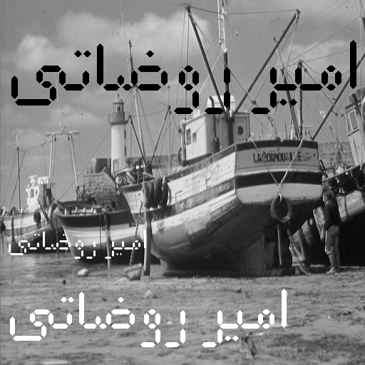

<div dir="rtl">

####  با دستورات ساده ی متلب سعی کنید اسم خودتان را با کلمات فارسی در یک تصویر ایجاد کنید. استفاده از توابع آماده ی رسم کاراکترها در این تمرین مجاز نیست. <br />


###### کد:
</div>

```matlab
clc;clear;close all;
imgout= imread("../../../benchmark/boat.png");


dd=[-973,-83,120.... %A
    911,95,10,-930,-120,26,911,146,10,-892,-120,26,855,147,50....%M
    -818,-115,35,782,147,50,804,189,6,776,189,6....%I
    -748,-115,35,-748,-180,35,712,212,38....%R
    -618,-115,35,-618,-180,35,582,212,38....%R
    511,95,10,-530,-120,26,511,146,10,-492,-120,26,-530,-180,35,496,212,38....%O
    400,95,50,-442,-120,26,400,146,50,-358,-120,26,338,147,10,-320,-127,15,294,147,30,402,53,6....%Z
    -263,-83,100....%A
    -222,-120,26,188,147,40,226,53,6,200,53,6....%T
    -156,-120,26,124,95,40,-92,-116,20,112,138,15,-130,-164,26,74,188,85,-22,-147,50]; %I

for nn=1:3
    if nn==1
        XX=50;YY=10;scale=2;C=0;
    end
    if nn==2
        XX=320;YY=10;scale=5;C=255;
    end
    if nn==3
        XX=400;YY=10;scale=2.5;C=255;
    end
    th=fix(8/scale);
    l=length(dd);k=1;    
    while (k <= l)
        Y=fix(dd(k)/scale);
        X=fix(dd(k+1)/scale);
        D=fix((dd(k+2)/2)/scale);

        if X>0 && Y>0  %horizontal
            y0=YY+Y-D;
            y1=YY+Y+D;
            x=XX+X;
            for i=1:th
                imgout(x-(th-i):x+(th-i),y1+i)=C;
                imgout(x-(th-i):x+(th-i),y0-i)=C;
            end
            imgout(x-th:x+th,y0:y1)=C;
        end
        if X<0 && Y<0   %vertical
            x0=XX+((X+D)*(-1));
            x1=XX+((X-D)*(-1));
            y=YY+(-1*Y);
            %x=x*(-1);y=y*(-1);
            for j=1:th
                imgout(x1+j,y-(th-j):y+(th-j))=C;
                imgout(x0-j,y-(th-j):y+(th-j))=C;
            end
            imgout(x0:x1,y-th:y+th)=C;
        end
        k=k+3;
    end
end
imwrite(imgout,"result.png");
imshow(imgout);    
```
---
<div dir="rtl">

#### برسی کد:
1-
- جهت جالب تر شدن تمرین تصمیم گرفتم نوشتها روی تصویر باشد.پس تصویر قایق را از شاخه بنچ مارک در ماتریس img لود کردیم.</div>

```matlab
imgout= imread("../../../benchmark/boat.png");
```
---
<div dir="rtl">

2- 
- یک ارایه ازمختصات نقاطی که خطهای افقی و عمودی را برای هر کاراکتر ذخیره کرده ایم .

تفاوت بین مختصات خطوط افقی و عمودی در علامت آنهاست خطوط عمودی بصورت منفی ذکر شده است.
</div>

```matlab
dd=[-973,-83,120.... %A
    911,95,10,-930,-120,26,911,146,10,-892,-120,26,855,147,50....%M
    -818,-115,35,782,147,50,804,189,6,776,189,6....%I
    -748,-115,35,-748,-180,35,712,212,38....%R
    -618,-115,35,-618,-180,35,582,212,38....%R
    511,95,10,-530,-120,26,511,146,10,-492,-120,26,-530,-180,35,496,212,38....%O
    400,95,50,-442,-120,26,400,146,50,-358,-120,26,338,147,10,-320,-127,15,294,147,30,402,53,6....%Z
    -263,-83,100....%A
    -222,-120,26,188,147,40,226,53,6,200,53,6....%T
    -156,-120,26,124,95,40,-92,-116,20,112,138,15,-130,-164,26,74,188,85,-22,-147,50]; %I
```
---
<div dir="rtl">

3-

- حلقه for زیر کاری اضافی در تمرین است که به جای یک نوشته سه نوشته با رنگ متفاوت و اندازه متفاوت ترسیم میکند.
</div>

```matlab
for nn=1:3
    if nn==1
        XX=50;YY=10;scale=2;C=0;
    end
    if nn==2
        XX=320;YY=10;scale=5;C=255;
    end
    if nn==3
        XX=400;YY=10;scale=2.5;C=255;
    end
```
---
<div dir="rtl">

4-قسمت اصلی برنامه

- در خط اول th سایز نوشته را نگه می دارد.

- در خط دوم L طول آرایه مختصات کاراکتر ها را نگه می دارد.

- حلقه while روی آرایه حرکت کرده و خطوط عمودی و افقی را بنا یه شرط درون حلقه که علامت اعداد را چک می کند ترسیم می شود.

- حلقه for درون هر شرط مسئول ترسیم روی تصویر قایق در ماتریس imgout است.</div>

```matlab
    th=fix(8/scale);
    l=length(dd);k=1;    
    while (k <= l)
        Y=fix(dd(k)/scale);
        X=fix(dd(k+1)/scale);
        D=fix((dd(k+2)/2)/scale);

        if X>0 && Y>0  %horizontal
            y0=YY+Y-D;
            y1=YY+Y+D;
            x=XX+X;
            for i=1:th
                imgout(x-(th-i):x+(th-i),y1+i)=C;
                imgout(x-(th-i):x+(th-i),y0-i)=C;
            end
            imgout(x-th:x+th,y0:y1)=C;
        end
        if X<0 && Y<0   %vertical
            x0=XX+((X+D)*(-1));
            x1=XX+((X-D)*(-1));
            y=YY+(-1*Y);
            %x=x*(-1);y=y*(-1);
            for j=1:th
                imgout(x1+j,y-(th-j):y+(th-j))=C;
                imgout(x0-j,y-(th-j):y+(th-j))=C;
            end
            imgout(x0:x1,y-th:y+th)=C;
        end
        k=k+3;
    end
```
---
<div dir="rtl">

5-

- در نهایت تصویر خروجی در رسانه ذخیره شده و نمایش داده می شود.
</div>

```matlab
imwrite(imgout,"result.png");
imshow(imgout);
```
<div dir="rtl">
تصویر خروجی:<br />
</div>


