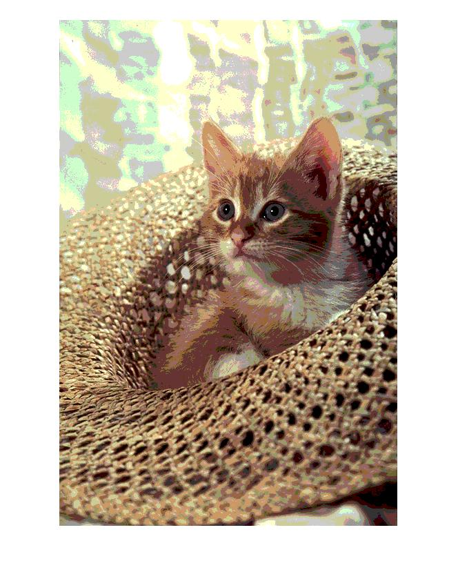

<div dir="rtl">

####  رنگ های موجود در یکی از تصاویر benchmark را به انتخاب خودتان به safe color تبدیل کنید.<br />


###### کد:
</div>

```matlab
clc;clear;close all;

img=imread("../../../benchmark/cat.png");
imgsc=img;
[xs,ys,zs]=size(img);
for i= 1:xs
    for j =1:ys
        for k=1:zs
            imgsc(i,j,k)=fix(img(i,j,k)/51)*51;
        end
    end
end
imshow(imgsc);
```
---
<div dir="rtl">

#### برسی کد:
1-
- خواندن تصویر cat.png از شاخه بنچ مارک در ماتریس img
- ساخت یک کپی از ماتریس img در imgsc
- بدست آوردن ابعاد ماتریس و قرار دان آنها در متغیر مربوطه
</div>

```matlab
img=imread("../../../benchmark/cat.png");
imgsc=img;
[xs,ys,zs]=size(img);
```
---
<div dir="rtl">

2-
- حلقه for تودرتو که کل ماتریس تصویر را پیمایش می کند و مقدار هر رنگ را بر عدد 51 تقسیم کرده و مقدار آن را به عدد صحیح در ماتریس کپی قرار می دهد.
</div>

```matlab
for i= 1:xs
    for j =1:ys
        for k=1:zs
            imgsc(i,j,k)=fix(img(i,j,k)/51)*51;
        end
    end
end
```
---
<div dir="rtl">

3-
- نمایش تصویر خروجی با دستور imshow
</div>

```matlab
imshow(imgsc);
```
<div dir="rtl">
تصویر خروجی:<br />
</div>


