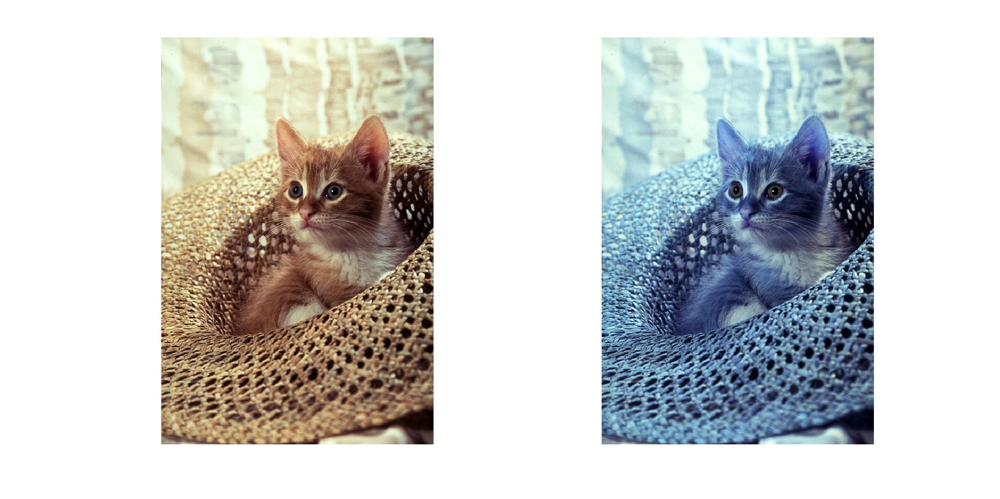

<div dir="rtl">

####  کانال رنگی آبی و قرمز یک تصویر را با هم جابجا کنید و خروجی را نمایش دهید.<br />


###### کد:
</div>

```matlab
clc;clear;close all;

img=imread("../../../benchmark/cat.png");
subplot(1,2,1),imshow(img);
R = img(:, :, 1);G = img(:, :, 2);B = img(:, :, 3);
[sr,sc,sz] = size(img);
imgout = zeros(sr, sc, sz, 'uint8');
for r=1:sr
   for c=1:sc
       imgout(r,c,1)=B(r,c);
       imgout(r,c,2)=G(r,c);
       imgout(r,c,3)=R(r,c);
   end
end
subplot(1,2,2),imshow(imgout);
```
---
<div dir="rtl">

#### برسی کد:
1-
- خواندن تصویر cat.png از شاخه بنچ مارک در ماتریس img
- در خط سوم هر کانال تصویر رنگی را در ماتریس های جدا  گانه R ,G ,B قرار می دهیم.
- بدست آوردن ابعاد ماتریس و قرار دان آنها در متغیر مربوطه
 </div>

```matlab
img=imread("../../../benchmark/cat.png");
subplot(1,2,1),imshow(img);
R = img(:, :, 1);G = img(:, :, 2);B = img(:, :, 3);
[sr,sc,sz] = size(img);
```
---
<div dir="rtl">

2-
- حلقه for تودرتو که کل ماتریس تصویر را پیمایش می کند و مقدار کنال های R و Bرا جابجا در ماتریس  imgout کپی قرار می دهد.
 </div>

```matlab
for r=1:sr
   for c=1:sc
       imgout(r,c,1)=B(r,c);
       imgout(r,c,2)=G(r,c);
       imgout(r,c,3)=R(r,c);
   end
end
```
---
<div dir="rtl">

3-
- نمایش تصویر خروجی با دستور imshow,subplot
</div>

```matlab
subplot(1,2,2),imshow(imgout);
```
<div dir="rtl">
تصویر خروجی:<br />
</div>


