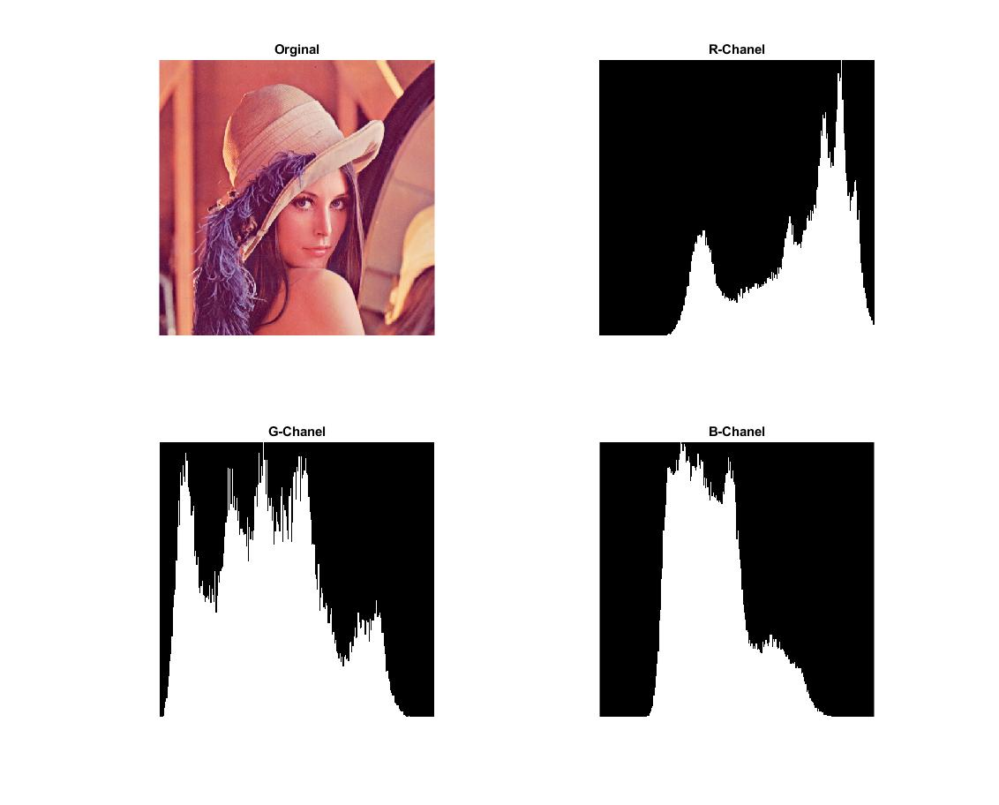

<div dir="rtl">

####  بدون استفاده از توابع آماده ی متلب هیستوگرام هر یک از کانال های رنگی یکی از تصاویر را به صورت جداگانه محاسبه کنید. کدهای هیستوگرام را تبدیل به یک تابع در فایل جداگانه کنید و برای هر سه کانال رنگی آن را فراخوانی کنید. <br />


###### کد اصلی:
</div>

```matlab
clc;clear;close all;

img = imread("../../../benchmark/lena.png");
R = img(:, :, 1);G = img(:, :, 2);B = img(:, :, 3);
Rhist=chanelhist(R);
Ghist=chanelhist(G);
Bhist=chanelhist(B);
RNhist=fix((Rhist/max(Rhist))*255);
GNhist=fix((Ghist/max(Ghist))*255);
BNhist=fix((Bhist/max(Bhist))*255);
RHimg= zeros(255,255,'uint8');
GHimg= zeros(255,255,'uint8');
BHimg= zeros(255,255,'uint8');
for j=1:255
    for i=RNhist(1,j):-1:1
        RHimg(256-i,j)=255;
    end
    for i=GNhist(1,j):-1:1
        GHimg(256-i,j)=255;
    end
    for i=BNhist(1,j):-1:1
        BHimg(256-i,j)=255;
    end
end
subplot(2,2,1),imshow(img),title('Orginal');
subplot(2,2,2),imshow(RHimg),title('R-Chanel');
subplot(2,2,3),imshow(GHimg),title('G-Chanel');
subplot(2,2,4),imshow(BHimg),title('B-Chanel');
```
<div dir="rtl">

###### کد  تابع:
</div>

```matlab
function [y]=chanelhist(img)
[r,c]=size(img);
y=zeros(1,256);
for i=1:r
 for j=1:c
    z=img(i,j);
    y(z+1)=y(z+1)+1;
 end
end
```
---
<div dir="rtl">

#### برسی کد:
1-
- خواندن تصویر linda.png از شاخه بنچ مارک در ماتریس img
- جدا کردن کانالهای R,G,B ماتریس تصویر در ماتریسهای جدا گانه
-هر کانال را بعنوان پارامتر تابعی که جهت استخراج هیستوگرام نوشتیم ودر انتهای مطالب تو ضیح آن آمده است قرار می دهیم.
- ماترسهای خروجی بدست آمده را نرمال می کنیم
- پس از آن هر یک را در یک ماتریس تصویر خاکستری ( بهتر است سیاه و سفید باشد) قرار می دهیم.
 </div>

```matlab
img = imread("../../../benchmark/lena.png");
R = img(:, :, 1);G = img(:, :, 2);B = img(:, :, 3);
Rhist=chanelhist(R);
Ghist=chanelhist(G);
Bhist=chanelhist(B);
RNhist=fix((Rhist/max(Rhist))*255);
GNhist=fix((Ghist/max(Ghist))*255);
BNhist=fix((Bhist/max(Bhist))*255);
RHimg= zeros(255,255,'uint8');
GHimg= zeros(255,255,'uint8');
BHimg= zeros(255,255,'uint8');
```
---
<div dir="rtl">

2-
- حلقه for تودرتو که کل ماتریس ساخته شده برای هر تصویر را قرینه عمودی می کند تا به استانداد نمایش هیستو گرام تبدیل شود.
 </div>

```matlab
for j=1:255
    for i=RNhist(1,j):-1:1
        RHimg(256-i,j)=255;
    end
    for i=GNhist(1,j):-1:1
        GHimg(256-i,j)=255;
    end
    for i=BNhist(1,j):-1:1
        BHimg(256-i,j)=255;
    end
end
```
---
<div dir="rtl">

3-
- نمایش تصویر اصلی و هستوگرام هر کانال خروجی با دستور imshow,subplot
</div>

```matlab
subplot(2,2,1),imshow(img),title('Orginal');
subplot(2,2,2),imshow(RHimg),title('R-Chanel');
subplot(2,2,3),imshow(GHimg),title('G-Chanel');
subplot(2,2,4),imshow(BHimg),title('B-Chanel');
```
<div dir="rtl">

4-
- اندازه ماتریس ورودی را در دو متغییر r , c  قرار می دهد.
- تابع تعریف شده یک ماتریس یک بعدی با 255 خانه به نام y درست می کند.
- حلقه for تودر تو ماتریس ورودی را پیمایش کرده و برای هر مقدار(0-255) پیکسلها را میشمرد.
- در نهایت ماتریس y را که حاوی تعداد هر مقدار است بر می گرداند.
</div>

```matlab
function [y]=chanelhist(img)
[r,c]=size(img);
y=zeros(1,256);
for i=1:r
 for j=1:c
    z=img(i,j);
    y(z+1)=y(z+1)+1;
 end
end
```
<div dir="rtl">
تصویر خروجی:<br />
</div>


