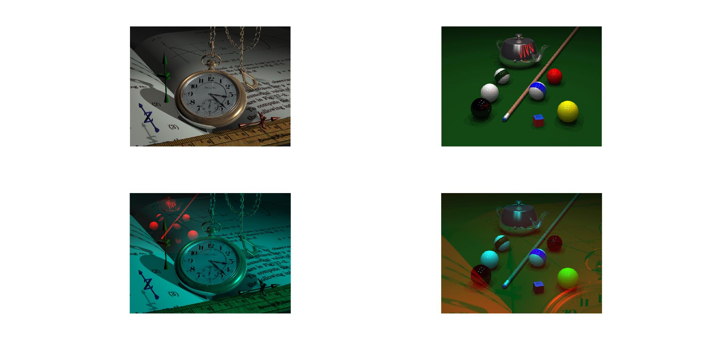

<div dir="rtl">

####  کانال رنگی قرمز تصویر watch.png را با کانال رنگی قرمز تصویر pool.png جا به جا کنید و خروجی هر دو را نمایش دهید. <br />


###### کد اصلی:
</div>

```matlab
clc;clear;close all;

imgwatch=imread("../../../benchmark/watch.png");
[rw,cw,zw]=size(imgwatch);
subplot(2,2,1),imshow(imgwatch)
imgpool=imread("../../../benchmark/pool.png");
[rp,cp,zp]=size(imgpool);
subplot(2,2,2),imshow(imgpool);
R_watch = imgwatch(:, :, 1);
R_pool = imgpool(:, :, 1);
imgwatch(:, :, 1)=0;
imgpool(:, :, 1)=0;
for r=1:rw
   for c=1:cw
       if (r<=rp&& c<=cp)
          imgwatch(r,c,1)=R_pool(r,c);
          imgpool(r,c,1)=R_watch(r,c);
       end
   end
end
subplot(2,2,3),imshow(imgwatch);
subplot(2,2,4),imshow(imgpool); 

```
---
<div dir="rtl">

#### برسی کد:
1-

- دو تصویر ساعت و استخر از شاخه بنچ مارک در دو ماتریس لود شده اند.
- ابعاد هر ماتریس تصویر با دستور size بدست آمده و در متغییر های مربوطه جهت استفاده های بعدی ذخیره می شود.
- نمایش تصاویر اصلی توسط دستور subplot </div>

```matlab
imgwatch=imread("../../../benchmark/watch.png");
[rw,cw,zw]=size(imgwatch);
subplot(2,2,1),imshow(imgwatch)
imgpool=imread("../../../benchmark/pool.png");
[rp,cp,zp]=size(imgpool);
subplot(2,2,2),imshow(imgpool);
```
---
<div dir="rtl">

2-

- کانال قرمز هر دو تصویر جدا شده و در ماتریسهاس مربوطه قرار میگیرد.
- از آنجا که سایز دو تصویر برابر نیست کانال قرمز دو تصویر صفر میگردد تا در صورتی که تصویر کوچمتر روی تصویر بزرکتر قرار گرفت مشکل حل شود.
</div>

```matlab
R_watch = imgwatch(:, :, 1);
R_pool = imgpool(:, :, 1);
imgwatch(:, :, 1)=0;
imgpool(:, :, 1)=0;
```
---
<div dir="rtl">

3-

- حلقه for تودرتو که کانال قررمز دو تصویر که قبلا جدا شده را در تصویر دیگر کپی می کند.
</div>

```matlab
for r=1:rw
   for c=1:cw
       if (r<=rp&& c<=cp)
          imgwatch(r,c,1)=R_pool(r,c);
          imgpool(r,c,1)=R_watch(r,c);
       end
   end
end
```
<div dir="rtl">

4-

- در نهایت دو تصویر نهایی با دستور subplot , imshow نماییش داده می شود.
</div>

```matlab
subplot(2,2,3),imshow(imgwatch);
subplot(2,2,4),imshow(imgpool); 
```
<div dir="rtl">
تصویر خروجی:<br />
</div>


