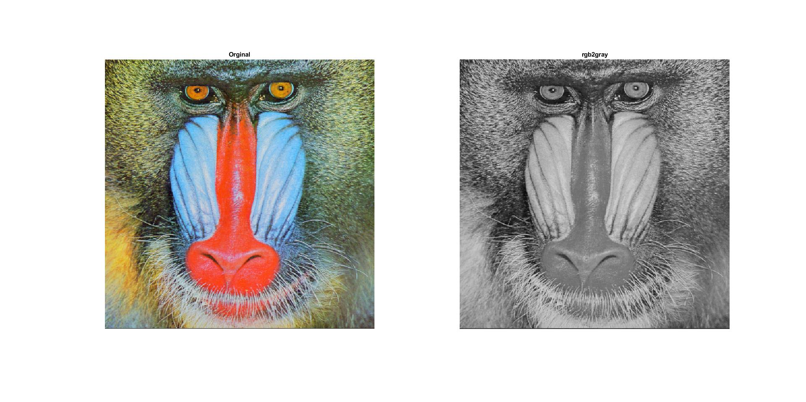

<div dir="rtl">

#### برنامه ای بنویسید که بدون استفاده از توابع متلب تصاویر benchmark را به حالت خاکستری ببرد.  <br />


###### کد:
</div>

```matlab
clc;clear;close all;

img=imread("../../../benchmark/baboon.png");
subplot(1,2,1),imshow(img),title('Orginal');

R = img(:, :, 1);G = img(:, :, 2);B = img(:, :, 3);
[sr,sc,sz] = size(img);

gryimg = zeros(sr, sc, 'uint8');

for x=1:sr
   for y=1:sc
       %0.2989 * R + 0.5870 * G + 0.1140 * B
       gryimg(x,y) = (R(x,y)*.29)+(G(x,y)*.59)+(B(x,y)*.11);
   end
end

subplot(1,2,2),imshow(gryimg),title('rgb2gray');
```

<div dir="rtl">

#### برسی کد:
1-بار کردن و نمایش تصویر رنگی ورودی <br />
</div>

```matlab
img=imread("../../../benchmark/baboon.png");
subplot(1,2,1),imshow(img),title('Orginal'); 
```
<div dir="rtl">
2-جدا کردن 3 کانال رنگ در 3 ماتریس<br />
</div>

```matlab
R = img(:, :, 1);G = img(:, :, 2);B = img(:, :, 3);
```

<div dir="rtl">
3-ایجاد تصویر خاکستری به ابعاد تصویر ورودی با ماتریس صفر <br />
</div>

```matlab
gryimg = zeros(sr, sc, 'uint8');
```
<div dir="rtl">
4-حلقه تو در تو و پیمایش تک تک پیکسلها و محاسبه سطح خاکستری از روی 3 موئلفه RGB در فورمول.<br />
</div>

```matlab
for x=1:sr
   for y=1:sc
       gryimg(x,y) = (R(x,y)*.29)+(G(x,y)*.59)+(B(x,y)*.11);
   end
end
```
<div dir="rtl">
تصویر خروجی:<br />
</div>

