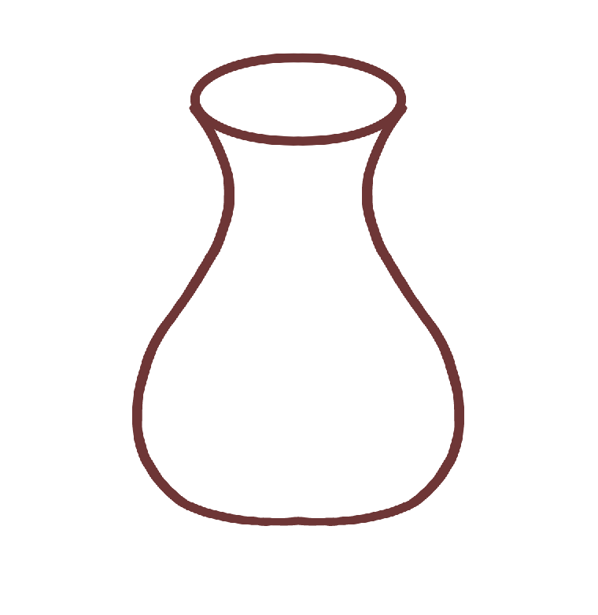

<div dir="rtl">

#### یک تصویر کوزه ی ناقص رو کاغذ بکشید و تصویر آن را با کمک نرم افزار متلب کامل کنید؛ در واقع تقارن تصویر را به تصویر اصلی بچسبانید و یک کوزه ی کامل ایجاد کنید.   <br />


###### کد:
</div>

```matlab
clc;clear;close all;

img=imread("jug.png");
[sx,sy,sz]=size(img);

resultimg = zeros(sx, sy*2, sz,'uint8');

for x=1:sx
   for y=1:sy
       resultimg(x,y,:) = img(x,y,:);
       resultimg(x,sy+y,:)=img(x,sy-y+1,:);
   end
end
imshow(resultimg);
```

<div dir="rtl">

#### برسی کد:
1-لود کردن تصویر کوزه ناقص در ماتریس img<br />
استخراج ابعاد ماتریس img
</div>

```matlab
img=imread("jug.png");
[sx,sy,sz]=size(img);
```

<div dir="rtl">
2-ایجاد تصویر رنگی RGB به ابعاد عرض و دوبرابر تصویر کوزه ناقص با ایجاد ماتریس با درایه های صفر <br />
</div>

```matlab
resultimg = zeros(sx, sy*2, sz,'uint8');
```
<div dir="rtl">
3-حلقه تو در تو برای کپی کردن هر پیکسل از تصویر کوزه ناقص و قرینه آن در تصویر نهایی<br />
</div>

```matlab
for x=1:sx
   for y=1:sy
       resultimg(x,y,:) = img(x,y,:);
       resultimg(x,sy+y,:)=img(x,sy-y+1,:);
   end
end
```
<div dir="rtl">
تصویر خروجی:<br />
</div>

