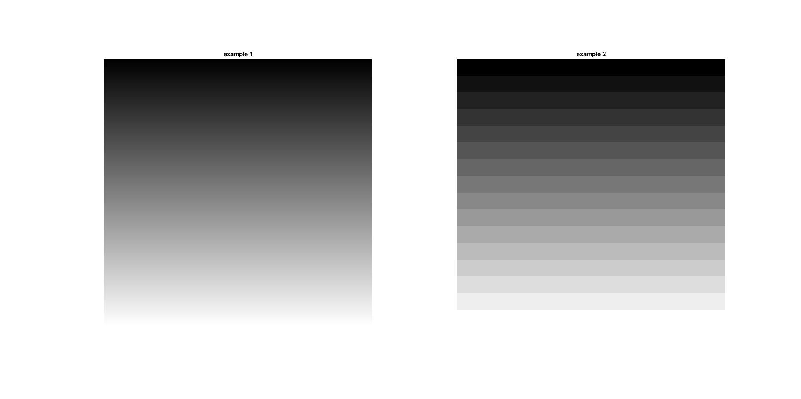

<div dir="rtl">

#### یک تصویر راه راه بسازید که از سمت بالا سیاه کامل و پایین آن سفید باشد.    <br />


###### کد:
</div>

```matlab
clc;clear;close all;

img=zeros(256*3,'uint8');
for i = 0:255
    img((i*3)+1:(i*3)+3,1:256*3)=i;
end
subplot(1,2,1),imshow(img),title('example 1');

for i = 0:255
    img((i*3)+1:(i*3)+3,1:256*3)=fix(i/16)*17;
end
subplot(1,2,2),imshow(img),title('example 2');
```

<div dir="rtl">

#### برسی کد:


1-ایجاد تصویر خاکستری با ایجاد ماتریس با درایه های صفر <br />
</div>

```matlab
img=zeros(256*3,'uint8');
```
<div dir="rtl">
2- با افزایش متغیر حلقه هر سه ردیف پیکسل یک شماره روشنتر می شود.<br />
</div>

```matlab
for i = 0:255
    img((i*3)+1:(i*3)+3,1:256*3)=i/255;
end
```
<div dir="rtl">
2- با افزایش متغیر حلقه هر چهل و هشت ردیف پیکسل شانزده شماره روشنتر می شود.<br />
</div>

```matlab
for i = 0:255
    img((i*3)+1:(i*3)+3,1:256*3)=fix(i/16)*17;
end
```
<div dir="rtl">
تصویر خروجی:<br />
</div>

