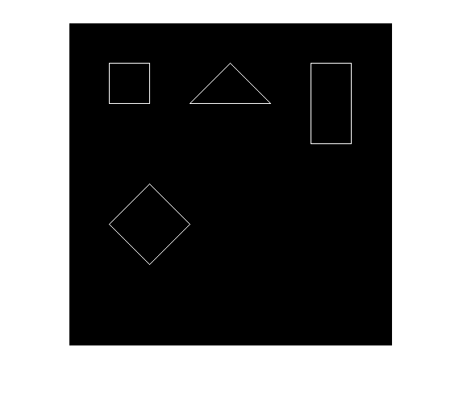

<div dir="rtl">

#### تمرین 7
#### اشکال هندسی مربع، مستطیل، لوزی، مثلث را بدون توابع متلب رسم کنید. <br />

### کد:
</div>

```matlab
clc;close all;clear;
polyline=0;
img=zeros(400,'uint8');
dd=[polyline,50,50,100,50,100,100,50,100,50,50,... %spure
    polyline,50,200,100,250,100,150,50,200,...   %triangle
    polyline,50,300,50,350,150,350,150,300,50,300,... %rectangle
    polyline,200,100,250,150,300,100,250,50,200,100]; %Diamond
l=length(dd)-2;k=1;
while (k < l)
    if (dd(k)==0) k=k+1; end
    if (dd(k+2)==0) k=k+3; end
    
    x0=dd(k);y0=dd(k+1);x1=dd(k+2);y1=dd(k+3);
    if( x0 == x1 ) img(x0,y0:y1); end %Draw vertical line
    %Simplified Bresenham algorithm
    dx = abs(x1-x0);
    dy = abs(y1-y0);
 
    if(x0 < x1) sx = 1;else sx = -1; end
    if(y0 < y1) sy = 1;else sy = -1; end
 
    err = dx - dy;
    x= x0;y = y0;
 
    while(true)
        img(x,y)=255; %setPixel
        if( x == x1 )&&( y == y1) break; end
        e2 = 2*err;
        if( e2 > -dy ) err = err - dy; x = x + sx; end
        if( e2 <  dx ) err = err + dx; y = y + sy; end
    end 
    k=k+2;
end
imshow(img);
```
---
<div dir="rtl">

#### برسی کد:
من تصمیم گرفتم بجای رسم هر شکل بصورت کد جدا یک برنامه که پلی گونهای هر شکل را با استفاده از الگوریتم خط میکشد بنویسم به شکلی که همه بصورت یه کد برنامه باشد هر چند اگر بصورت فانکشن نوشته می شد اصولی تر و راحت تر بود.


1.
-  ایجاد تصویر خاکستری با ایجاد ماتریس با درایه صفر  <br />
</div>

```matlab
img=zeros(400,'uint8');
```
---
<div dir="rtl">

2.
-  آرایه ای از عداد که  مختصات ابتدا و انتهای خطوط و به ترتیب سایر خطوط پلی لاین ها را نگه می دارد و از آنجا که مختصات صفر تعریف نشده است از آن برای مشخص شدن شروع شکل جدید استفاده شده است.
</div>

```matlab
dd=[polyline,50,50,100,50,100,100,50,100,50,50,... %spure
    polyline,50,200,100,250,100,150,50,200,...   %triangle
    polyline,50,300,50,350,150,350,150,300,50,300,... %rectangle
    polyline,200,100,250,150,300,100,250,50,200,100]; %Diamond
```
---

<div dir="rtl">

3.
- در خط اول از دستور length برای بدست آوردن طول آرایه استفاده شده است و k که شمارنده حلقه خارجی است برابر یک مقدار دهی شده است.
-  حلقه while  بیرونی روی آرایه dd حرکت می کند و داده های خط ها را از آرایه  را  استخراج می کند و در متغیر های x0 , y0 ,x1 , y1 قرار میدهد.
- حلقه while داخلی خطوط را بر اساس الگریتم  [Simplified Bresenham](https://www.cs.helsinki.fi/group/goa/mallinnus/lines/bresenh.html) ترسیم می کند.
- برای درک الگوریتم خط به لینک روبرو مراجعه کنید:
[Simplified Bresenham](https://www.cs.helsinki.fi/group/goa/mallinnus/lines/bresenh.html)
</div>

```matlab
l=length(dd)-2;k=1;
while (k < l)
    if (dd(k)==0) k=k+1; end
    if (dd(k+2)==0) k=k+3; end
    
    x0=dd(k);y0=dd(k+1);x1=dd(k+2);y1=dd(k+3);
```
##### الگوریتم خط
```matlab
    if( x0 == x1 ) img(x0,y0:y1); end %Draw vertical line
    %Simplified Bresenham algorithm
    dx = abs(x1-x0);
    dy = abs(y1-y0);
 
    if(x0 < x1) sx = 1;else sx = -1; end
    if(y0 < y1) sy = 1;else sy = -1; end
 
    err = dx - dy;
    x= x0;y = y0;
 
    while(true)
        img(x,y)=255; %setPixel
        if( x == x1 )&&( y == y1) break; end
        e2 = 2*err;
        if( e2 > -dy ) err = err - dy; x = x + sx; end
        if( e2 <  dx ) err = err + dx; y = y + sy; end
    end 
```
```matlab
    k=k+2;
end
```

<div dir="rtl">
تصویر خروجی:<br />
</div>

