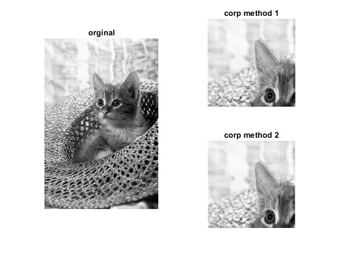

<div dir="rtl">

#### تمرین 9
####  برنامه ای بنویسید که یک طول و عرض را مشخص کرده و سپس یک تصویر را crop کند.<br />


### کد:
</div>

```matlab
clc;clear;close all;

row1=100;row2=300;col1=100;col2=300;

img=rgb2gray(imread("../../../benchmark/cat.png"));
subplot(1,2,1),imshow(img),title('orginal');

%method 1
drows=(row2-row1);
dcols=((col2-col1));
imgcrop=zeros(drows,dcols,'uint8');

for i = 1:drows
    for j = 1:dcols
        imgcrop(i,j)=img((row1+i),(col1+j));
    end
end
subplot(2,2,2),imshow(imgcrop),title('corp method 1');

%method 2
subImage = img(row1:row2, col1:col2, :);

subplot(2,2,4),imshow(subImage),title('corp method 2');
```
---
<div dir="rtl">

#### برسی کد:
1. 
- دریافت ورودی مختصات چپ بالا و راست پایین کادر برش(میتواند با استفاده از دستور input از کاربر گرفته شود.)<br/>
</div>

```matlab
row1=100;row2=300;col1=100;col2=300;
```
---
<div dir="rtl">

2.
-  لود تصویر در ماتریس img <br />
-  تبدیل تصویر RGB به خاکستری و نمایش آن
</div>

```matlab
img=rgb2gray(imread("../../../benchmark/cat.png"));
subplot(1,2,1),imshow(img),title('orginal');
```
---
<div dir="rtl">

3.
-  در روش اول از حلقه for تو در تو برای کپی کردن تک تک پیکسل های ناحیه مورد نظر استفاده شده است.
</div>

```matlab
%method 1
drows=(row2-row1);
dcols=((col2-col1));
imgcrop=zeros(drows,dcols,'uint8');

for i = 1:drows
    for j = 1:dcols
        imgcrop(i,j)=img((row1+i),(col1+j));
    end
end
```
---
<div dir="rtl">

4.
-  در روش دوم از دستورات متلب برای کپی کردن قسمتی از ماتریس استفاده شده است.
</div>

```matlab
%method 2
subImage = img(row1:row2, col1:col2, :);
```
<div dir="rtl">
تصویر خروجی:<br />
</div>

