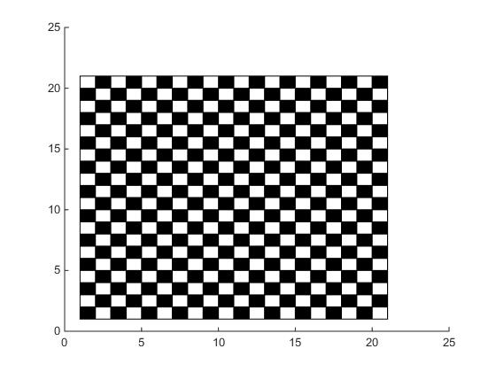

#### tamrin 1 code:


```
s1= input('row= ');
s2= input('column= ');

m=1
 
for i=1:s1
    
    for j=1:s2
        
        if isequal(m,0)
            rectangle('Position',[j i 1 1], 'FaceColor',[1 1 1])
            m=1;
        else
            rectangle('Position',[j i 1 1], 'FaceColor',[0 0 0])
            m=0;
        end
        
    end
    
     if isequal(m,0)
            m=1;
     else
            m=0;
     end
     
end
```


