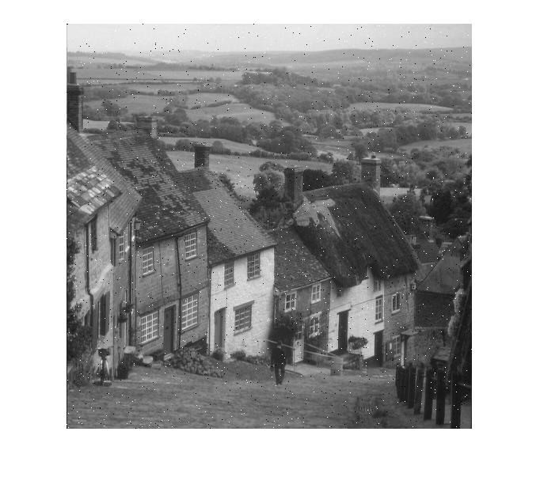

#### tamrin 11 code:


```
img=imread('C:\Users\Nakisa™\Documents\GitHub\image-processing-class\benchmark\goldhill.png');
 
for i=1:1500
    a=randi([1,size(img,1)]);
    b=randi([1,size(img,2)]);
    img(a,b)=randi([0,1])*255;
end
imshow(img);

```


