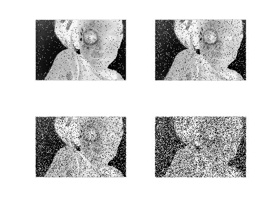

#### tamrin 13 code:


```
image_boat = imread('C:\Users\Nakisa™\Documents\MATLAB\negative.jfif');
noise_boat = imnoise(image_boat,'salt & pepper',0.05);
subplot(2,2,1); imshow(noise_boat);

noise_boat = imnoise(image_boat,'salt & pepper',0.1);
subplot(2,2,2); imshow(noise_boat);

noise_boat = imnoise(image_boat,'salt & pepper',0.25);
subplot(2,2,3); imshow(noise_boat);

noise_boat = imnoise(image_boat,'salt & pepper',0.5);
subplot(2,2,4); imshow(noise_boat);


```


