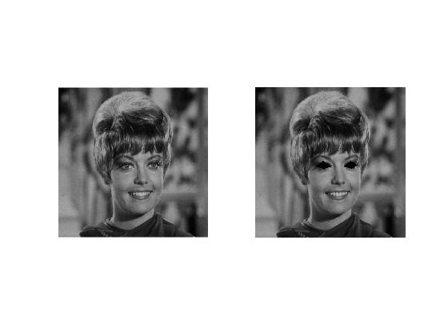

#### tamrin 15 code:


```
img=imread('C:\Users\Nakisa™\Documents\GitHub\image-processing-class\benchmark\zelda.png');
subplot(1,2,1);
imshow(img);

l=[208 269 231 251 262 269 233 280];
r=[302 270 326 251 348 266 329 278];
img = insertShape(img,'FilledPolygon',{l,r},'Color',[0 0 0],'Opacity',1);
subplot(1,2,2); 
imshow(img);

```


