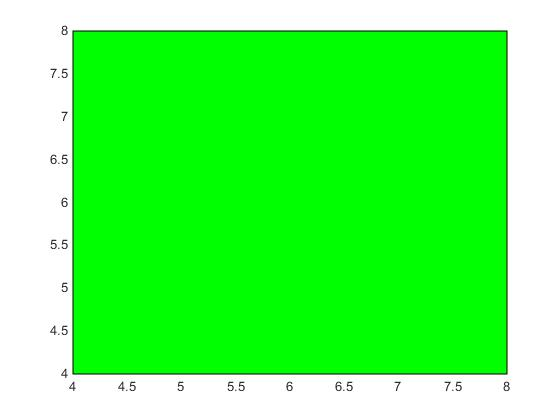
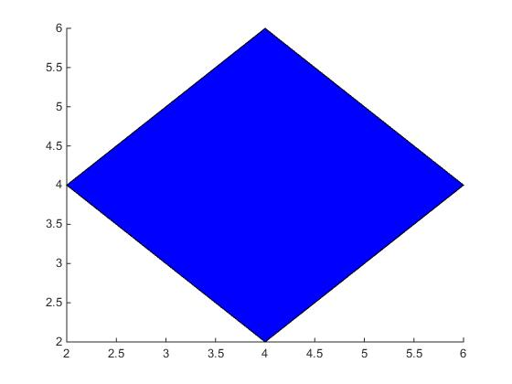
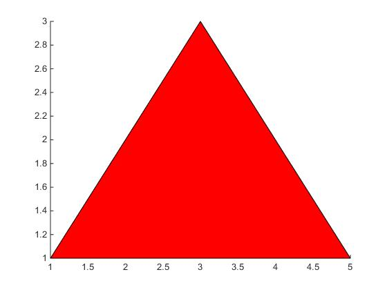

#### tamrin 7 code:

###### sguare:

```
x=[4 8 8 4 4];
y=[4 4 8 8 4];
color = [0 1 0];
patch(x,y,color);

```





########diamond:

 ```

x=[4 6 4 2];
y=[6 4 2 4];
color = [0 0 1];
patch(x,y,color);

 ```



######## triangle:

```
x=[1 3 5];
y=[1 3 1];
color = [1 0 0];
patch(x,y,color);

```

