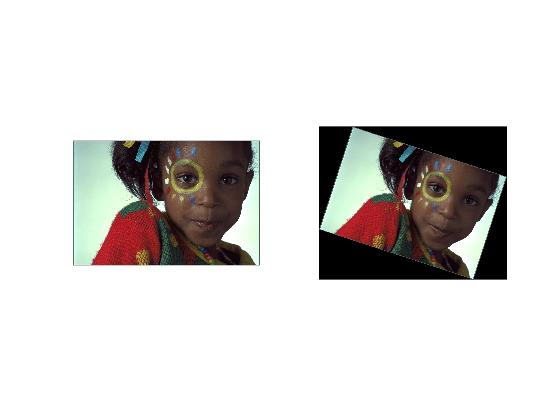
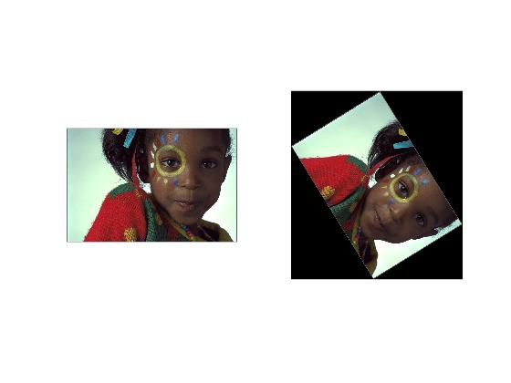
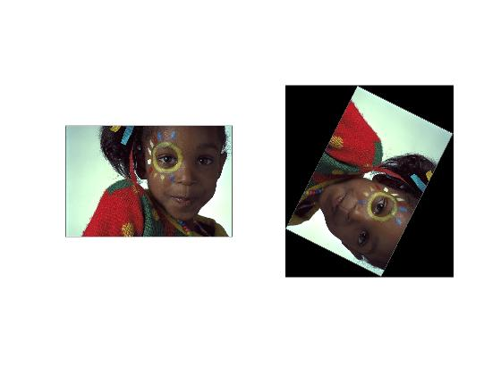
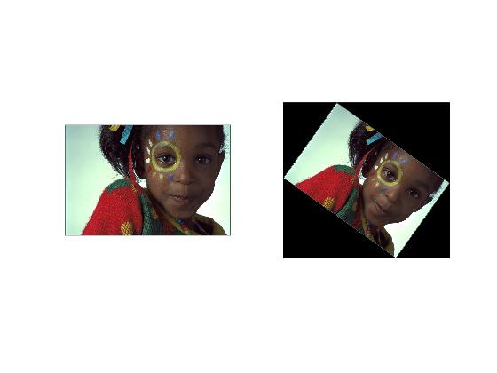

#### tamrin 8 code:


```
img=imread('C:\Users\Nakisa™\Documents\GitHub\image-processing-class\benchmark\girl.png');

theta = input('please insert degree');
rmat = [
cos(theta) sin(theta) 0
-sin(theta) cos(theta) 0
0           0          1];

mx = size(img,2);
my = size(img,1);
corners = [
    0  0  1
    mx 0  1
    0  my 1
    mx my 1];
new_c = corners*rmat;

T = maketform('affine', rmat);   %# represents translation
img2 = imtransform(img, T, ...
    'XData',[min(new_c(:,1)) max(new_c(:,1))],...
    'YData',[min(new_c(:,2)) max(new_c(:,2))]);
subplot(121), imshow(img);
subplot(122), imshow(img2);

```

picture:


rotate 45:


rotate 90:


rotate 120:
