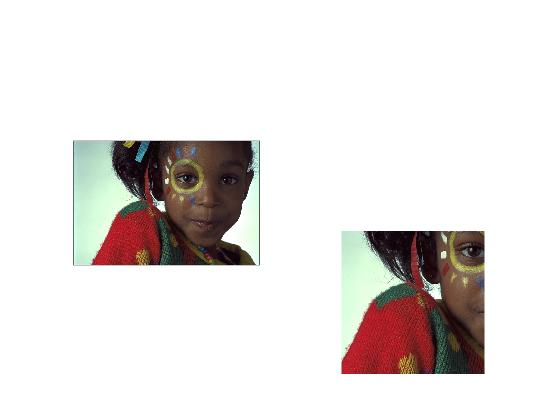

#### tamrin 9 code:


```
img=imread('C:\Users\Nakisa™\Documents\GitHub\image-processing-class\benchmark\girl.png');
row1=input('please insert row1');
row2=input('please insert row2');
col1=input('please insert col1');
col2=input('please insert col2');
subplot(1,2,1),imshow(img);
subImage = img(row1:row2, col1:col2, :);
subplot(2,2,4),imshow(subImage);

```


