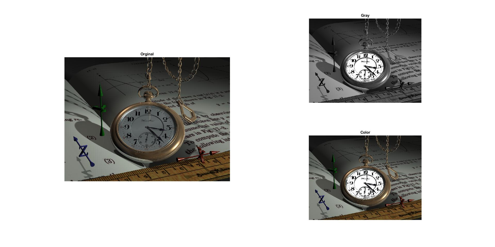

<div dir="rtl">

####  تمرین 18 <br />
#### سعی کنید صفحه ی ساعت تصویر watch.png را کاملا سفید کنید. <br />


### کد:
</div>

```matlab
clc;clear;close all;

img=(imread("../../../benchmark/watch.png"));
imggray=rgb2gray(img);
subplot(1,2,1),imshow(img),title('Orginal');
[sr,sc,sz] = size(img);

R = img(:, :, 1);G = img(:, :, 2);B = img(:, :, 3);

for x=1:sr
   for y=1:sc
       if (R(x,y)< 100) &&(R(x,y)> 81) && (abs((G(x,y)-B(x,y)))< 2) 
            imggray(x,y) = 255;
            img(x,y,1) = 255;img(x,y,2) = 255;img(x,y,3) = 255;
       end
   end
end

subplot(2,2,2),imshow(imggray),title('Gray');
subplot(2,2,4),imshow(img),title('Color');
```

<div dir="rtl">

---
#### برسی کد:

1. <br/>
- لود تصویر رنگی در متغیر img <br/>
- تبدیل آن به تصویر خاکستری <br/>
- نمایش آن ، در نهایت بدست آوردن ابعاد تصویر و ذخیره آن در متغییر مربوطه
</div>

```matlab
img=(imread("../../../benchmark/watch.png"));
imggray=rgb2gray(img);
subplot(1,2,1),imshow(img),title('Orginal');
[sr,sc,sz] = size(img);
```
<div dir="rtl">

---
2. <br/>
- جدا کردن کانال های رنگ RGB تصویر در متغیرهای مربوطه بصورت ماتریس<br />
</div>

```matlab
R = img(:, :, 1);G = img(:, :, 2);B = img(:, :, 3);
```

<div dir="rtl">

---
3. <br/>
- حلقه تو در تو جهت پیمایش پیکسلهای  تصویر <br/>
- شرط درون حلقه محدوده پیکسلها و محدوده رنگ مورد نظر جهت تغییرات راانتخاب می کند و آن پیکسلها را به رنگ سفید در می آورد <br />
</div>

```matlab
for x=1:sr
   for y=1:sc
       if (R(x,y)< 100) &&(R(x,y)> 81) && (abs((G(x,y)-B(x,y)))< 2) 
            imggray(x,y) = 255;
            img(x,y,1) = 255;img(x,y,2) = 255;img(x,y,3) = 255;
       end
   end
end
```
<div dir="rtl">

---
4-<br/>
- نمایش تصویر های خروجی 
</div>

```matlab
subplot(2,2,2),imshow(imggray),title('Gray');
subplot(2,2,4),imshow(img),title('Color');
```
<div dir="rtl">
با سپاس از توضیحات آقای روضاتی:<br />
</div>

