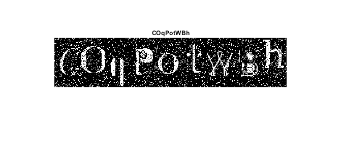

<div dir="rtl">

#### تمرین 19
#### با کمک روشی که در تمرین شماره ی 10 انجام داده اید این بار به جای اعداد از کلمات انگلیسی استفاده کنید و کپچا بسازید. <br />


###### کد:
</div>

```matlab
clc;clear;close all;

img=imbinarize(imread('A-Z.png'));
[m,n] = size(img);

imgcaptcha=zeros(0,0,'logical');

for i=0:8
    B=randi([0,8]);
    C=B*110+1;
    D=i*110+1;
    L=randi([0,2]);
    P=L*120+1;
    imgcaptcha(1:120,D:D+110) = img(P:P+119, C:C+110);
end    

figure;imshow(imgcaptcha);
```

<div dir="rtl">

---
#### برسی کد:
1. <br/>
- ابتدا فایل تصویر حاوی کاراکترها در ماتریس img بصورت سیاه و سفید لود می شوند
- ابعاد طول و عرض تصویر در متغیرهای ذخیره می شوند.
</div>

```matlab
img=imbinarize(imread('A-Z.png'));
[m,n] = size(img);
```
---
<div dir="rtl">

2. 
- ایجاد تصویر سیاه و سفید  با ایجاد ماتریس با درایه های صفر <br />
</div>

```matlab
imgcaptcha=zeros(0,0,'logical');
```
---
<div dir="rtl">

3. 
-  حلقه نه کاراکتر را از تصویر کاراکتر های منبع درون ماتریس img بصورت رندوم جدا کرده و کنار هم در تصویر خروجی می چیند.
- ارتفاع هر کاراکتر در تصویر منبع 120  و عرض آن 110 پیکسل است.
</div>

```matlab
for i=0:8
    B=randi([0,8]);
    C=B*110+1;
    D=i*110+1;
    L=randi([0,2]);
    P=L*120+1;
    imgcaptcha(1:120,D:D+110) = img(P:P+119, C:C+110);
end    
```
<div dir="rtl">
با سپاس از توضیحات آقای روضاتی:<br />
</div>

