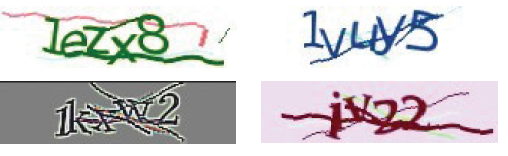

##  عنوان مقاله: فناوری تشخیص CAPTCHA مبتنی بر یادگیری عمیق

#### *چکیده*

آزمون تورینگ عمومی،  کاملاً خودکار برای تفکیک رایانه ها و انسانها (CAPTCHA) یک فن آوری مهم ماشین سازی انسان برای وب سایت برای جلوگیری از حمله خودکار برنامه مخرب است. مطالعات شناسایی CAPTCHA می تواند نقض امنیت در CAPTCHA را پیدا کند، فن آوری CAPTCHA را بهبود بخشد، همچنین می تواند فن آوری های تشخیص پلاک و تشخیص دست خط را ارتقا دهد. این مقاله برای شناسایی CAPTCHA و جلوگیری از فناوری سنتی پردازش تصویر مانند مکان و تقسیم بندی، روشی مبتنی بر مدل شبکه عصبی کانولوشن (CNN) را پیشنهاد داده است. نرخ یادگیری انطباقی برای تسریع میزان همگرایی مدل معرفی شده و  راه حل محلی بهینه حل شده است. از مدل آموزش مشترک چند منظوره برای بهبود دقت و توانایی تعمیم شناخت مدل استفاده می شود نتایج تجربی نشان می دهد که مدل دارای اثر تشخیص خوبی بر CAPTCHA با سر و صدای پس زمینه و اعوجاج چسبندگی کاراکتر است.

---
#### *۱- مقدمه*

با توسعه سریع صنعت اینترنت، مسائل امنیتی بیشتر توسعه می یابد. فناوری CAPTCHA طیف گسترده ای از برنامه ها را در محافظت از شبکه و امنیت اطلاعات دارد CAPTCHA مخفف Testing Publicing کاملاً خودکار برای تشخیص جدا شدن رایانه و انسان است. به عنوان یک استراتژی امنیتی شبکه، عمدتا برای وب سایت ها استفاده می شود تا از حملات خودکار برنامه های مخرب مانند ثبت نام خودکار، هرزنامه، رای گیری خودکار و غیره جلوگیری کند. برای انسان، دقت تشخیص CAPTCHA های موثر حداقل 80٪ است، اما برای رایانه ها، باید کمتر از 0.01٪ باشد.  تحقیق در مورد شناسایی CAPTCHA می تواند نقایص CAPTCHA را به موقع پیدا کند و پیشنهادات بهبودی را برای برنامه تولید کد ارائه دهد و امنیت CAPTCHA را افزایش دهد، در عین حال، به عنوان نوعی آزمون تورینگ، تشخیص CAPTCHA ترکیبی از تحقیق است نتایج حاصل از پردازش تصویر و زمینه هوش مصنوعی، و نقش مثبتی در توسعه فناوری هوش مصنوعی مانند تشخیص پلاک و تشخیص دست خط دارد.

این مقاله بر بیشترین و پرکاربردترین تصاویر مبتنی بر کاراکتر CAPTCHA را که از اعداد تصادفی و حروف انگلیسی تشکیل شده  متمرکز می شود. تولید آن آسان است، تحت تأثیر زمینه فرهنگی کاربر قرار  نمی گیرد. می توانیم توسط زبانهای اصلی برنامه نویسی تصویری حاوی اعداد و حروف ایجاد کنیم. به منظور افزایش دشواری تشخیص توسط رایانه، بهCAPTCHA ها باید نویز پس زمینه را اضافه کرده و کاراکترها پردازشی را پیچ و تاب دار کنیم.

در زمینه پردازش تصویر سنتی، فناوری تشخیص CAPTCHA به مراحل پیش پردازش تصویر، موقعیت یابی، تقسیم کاراکتر، تشخیص کاراکتر و سایر مراحل تقسیم می شود. با این حال، ایجاد یک مجموعه الگوی دقیق به دلیل  چسبیدگی و پیچیدگی CAPTCHA دشوار است. روش سنتی استخراج نقاط پیکسل یک به یک و تطبیق الگو، فقط می تواند CAPTCHA های ساده را تشخیص دهد، در حالی که هیچ روش کارآمد برای شناسایی CAPTCHA چسبیده و پیچیده وجود ندارد. بنابراین، یک روش کارآمد تر برای شناسایی چنین CAPTCHA مورد نیاز است.

 امروزه، شبکه یادگیری عمیق به طور گسترده ای در تحقیقات علمی استفاده می شود. به عنوان یکی از نقاط مهم در زمینه تحقیقات هوش مصنوعی در سال های اخیر، در بسیاری از زمینه ها مانند شناسایی تصویر، تشخیص گفتار، ... پردازش زبان طبیعی و تشخیص هدف موفقیت زیادی کسب کرده است. در مقایسه با روش تشخیص الگوی سنتی، بزرگترین مزیت یادگیری عمیق این است که می توان بدون طراحی مصنوعی ویژگیها را به طور فعال یاد گرفت. براساس مشاهدات و الهامات فوق الگوریتم شبکه عصبی کانولوشن (CNN) برای شناسایی CAPTCHA پیشنهاد شده است. برای مسئله نرخ همگرایی مدل و راه حل بهینه جهانی، نرخ یادگیری انطباقی برای بهبود توانایی یادگیری شبکه معرفی شده است و از همگرایی و استحکام بهتری برخوردار است. مدل آموزش مشترک چند منظوره برای افزایش سرعت آموزش مدل و بهبود توانایی تعمیم مدل استفاده می شود. روش این مقاله مستقیماً از تصاویر به عنوان ورودی استفاده می کند

---
#### *۲- تحقیقات مرتبط*

روش سنتی این است که یک عدد یا مناطق مشخصه را در یک تصویر قرار دهید و سپس کاراکترهای جداگانه را تقسیم و شناسایی کنید  از طریق این دو مرحله، نویسه های موجود در تصویر شناسایی می شوند. به عنوان مثال، یان و احمد، با موفقیت CAPTCHA های مایکروسافت را تقسیم بندی کردند و آن را با طبقه بندی های مختلف، با نرخ شناسایی 60٪ شناسایی کردند  موری و مالک با استفاده از روش زمینه شکل CAPTCHA ها را در تصاویر تشخیص می دهد . Chellapilla وسیمارد همچنین CAPTCHA ها را با تقسیم کردن کاراکترهای منفرد و شناسایی آنها حل می کند  دانشمندان داخلی همچنین تحقیقاتی را در زمینه شناسایی CAPTCHA بر اساس روش تقسیم بندی انجام داده اند. وانگ یانگ و دیگران پیشنهاد شده است که از فناوری K نزدیکترین همسایه (KNN) برای کد تأیید تشخیص استفاده شود. ژانگ شویا و دیگران از طریق CAPTCHA های تقسیم شده، نتایج تقسیم بندی به ترتیب با طبقه بندی KNN، شبکه انتشار عقب (BP) و دستگاه بردار پشتیبانی (SVM) مشخص شد و نرخ شناسایی بیش از 95٪ بود .

 با این حال، به منظور جلوگیری از شناسایی CAPTCHA به طور خودکار توسط رایانه و بهبود امنیت شبکه، کاراکترهای CAPTCHA فعلی تا حدی با هم همپوشانی دارند، به این ترتیب تقسیم کاراکتر منفرد بسیار دشوار می شود و در نتیجه بر دقت تشخیص تأثیر می گذارد. LeCun و همکاران، در مواجهه با محدودیت روشهای سنتی پردازش تصویر، به دنبال مشکلات فوق هستند. پیشنهاد شد که از روشهای یادگیری عمیق برای شناسایی ارقام دست نویس استفاده شود و از شبکه های عصبی کانولوشن برای استخراج ویژگی های تصویر و سپس طبقه بندی آنها استفاده شود.  با این حال، همه آنها باید تصاویر را تقسیم کنند. در عوض، از کل تصاویر به عنوان ورودی استفاده می کنیم تا مستقیماً نتیجه بگیریم.

 ---
 #### *۳ـ  روش پیشنهادی*
 #### الف - نرمال سازی کنتراست

نرمال سازی کنتراست می تواند از اشباع خروجی نورون ناشی از مقدار ورودی مطلق بیش از حد جلوگیری کند و اطمینان حاصل کند که مقادیر کوچک در داده های خروجی ازبین نمیروند. این می تواند تعمیم شبکه را افزایش دهد، تأثیر روشنایی و واریانس کنتراست را به طور موثر بر روی شبکه از بین ببرد، می تواند وابستگی بین عوامل همسایه را بسیار کاهش دهد و همگرایی شبکه را تسریع کند. قبل از آموزش شبکه، این مقاله تصویر را برای نرمال سازی کنتراست استخراج می کند. مقدار روشنایی تصویر (i,j)را بهI(i,j)  تنظیم کنید، و مقدار روشنایی پس از نرمال سازی کنتراست محلی Iʹ(i,j)  است، روش نرمال سازی کنتراست  می تواند به صورت زیر بیان شود

 

 
$$I^{\prime}(i, j)=\frac{I(\mathrm{i}, j)-\mu}{\sigma+C}$$

i متعلق به مجموعه {1,2,3,…,M} و j متلعق به مجموعه {1,2,3,…,N} ، M,N ابعاد بلوک های تصویر است. constant ثابت 1 است، اجتناب از مخرج صفر است. µ وσ میانگین و انحراف معیار مقادیر پیکسل تصویر است.

#### ب - آموزش مشترک چند وظيفه ای

یادگیری چند وظیفه روشی برای یادگیری ماشین در مقابل یادگیری تک وظیفه است. هدف اصلی بهبود توانایی تعمیم با استفاده از اطلاعات خاص دامنه در سیگنال های آموزشی پنهان در چندین کار مرتبط است. 
یادگیری چند وظیفه ای می تواند با استفاده از نمایش مشترک در آموزش موازی چند کار، این مهم را انجام دهد. اشتراک پارامتر شبکه یادگیری چند وظیفه ای، می تواند تعداد مدل ها را کاهش دهد، بهره وری یادگیری را بهبود بخشد.

 در طول آموزش مدل شناسایی CAPTCHA، برچسب های تصاویر به چندین وظیفه یادگیری تقسیم         می شوند، هر کار یک کاراکتر را آموزش می دهد و همه وظایف را با هم آموزش می دهد. ساختار شبکه آموزش مشترک چند منظوره در شکل 1 نشان داده شده است

شکل 1: مدل آموزش مشترک چند وظيفه ای

#### ج-  مدل شناسایی CAPTCHA

 VGG Net یک شبکه عصبی کانولوشن است که توسط گروه هندسه بینایی آکسفورد ساخته شده است. این مدل براساس معماری شبکه Alex Net ساخته شده است که لایه کانولوشن را عمیق تر می کند و اندازه هسته کانولوشن را کاهش می دهد. از طریق بهبود این دو جنبه، عملکرد VGG Net بسیار بهبود یافته است. با توجه به مزایای VGG Net، همراه با کار این مقاله، ما یک روش CNN عمیق برای شناسایی یک سری از شخصیت ها بدون تقسیم بندی قبل ارائه می دهیم. ساختار شبکه ای که ما از آن استفاده می کنیم در شکل 2 نشان داده شده است. هر تصویر CAPTCHA شامل 6 نویسه است. در لایه خروجی، هر 62 نورون یک کاراکتر را پیش بینی می کند. ما یک(x)θ bijection تعریف می کنیم که یک کاراکتر x متعلق است به {0,1,….9,a,b,….,z , A,B,...,Z} به یک عدد صحیحl  که متعلق است به مجموعه {0,…,61} 

 

$$
\theta(x)=\left\{\begin{array}{l}
0 \sim 9, x=^{\prime} 0^{\prime} \sim^{\prime} 9^{\prime} \\
10 \sim 35, x=^{\prime} \sim^{\prime} z^{\prime} \\
36-61, x={ }^{\prime} A^{\prime} \sim^{\prime} Z^{\prime}
\end{array}\right.
$$

62 نورون اول خروجی را به شخصیت اول توالی، 62 نورون دوم را به شخصیت دوم و غیره اختصاص می دهیم. لایه خروجی دارای 310=62×5  نورون است

شکل 2  ساختار CNN برای تشخیص CAPTCHA

اندازه ورودی مجموعه آموزش در این مقاله 224224× است، لبه ویژگی ورودی نقشه گسترش یافته است، به طوری که اندازه نقشه برداری از ویژگی خروجی همان نقشه برداری از ویژگی خروجی است. پارامترهای هر لایه از مدل در جدول نشان داده شده است. 

---
#### *۴- نتایج تجربی*

محیط سخت افزاری آزمایشی Windows 10 64 bit، Inter (R) Pentium (R) CPU G3258، RAM 8 GB و کارت گرافیک NVIDIA GT980Ti است. محیط نرم افزاری استفاده شده در آزمایش TensorFlow است.
از آنجا که هیچ مجموعه داده CAPTCHA عمومی وجود ندارد که بتوان در حال حاضر از آن استفاده کرد، و آموزش مدل های شبکه عصبی کانولوشن به تعداد زیادی داده نیاز دارد. برای حل این مشکل، ما از اسکریپت پایتون برای تولید تصاویر CAPTCHA با 5 کاراکتر استفاده می کنیم. هر کاراکتر به طور تصادفی از یک مجموعه 10 رقمی و 26 حرف انگلیسی گرفته می شود و کاراکترها تحریف    می شوند. در طول تولید CAPTCHA، ما تصاویر تکراری را حذف کردیم تا از قابلیت اطمینان مدل اطمینان حاصل کنیم. اندازه تصاویر 12848× است. مجموعه آموزش شامل5×104 تصاویر، مجموعه اعتبار سنجی شامل 2×104 تصاویر و مجموعه آزمون شامل 1000 تصویر است. شکل 3 نمونه هایی از CAPTCHA های تولید شده خودکار را نشان می دهد.

شکل 3:  نمونه CAPTCHA های مورد استفاده در آزمایشات

در این مقاله، از الگوریتم نزول شیب تصادفی (SGD) برای آموزش مدل استفاده شده است و راه حل بهینه جهانی با تعداد زیادی تکرار حاصل می شود. با این کار از این مسئله جلوگیری می شود که وقتی مدل به یک بهینه محلی می رسد، عملکرد از دست دادن کاهش نمی یابد. میزان یادگیری به صورت سازگار است.
 با توجه به تعداد تکرار تغییر می کند، و میزان یادگیری با فرمول lr=lr0×(1/(1+decay×i)) تغییر می کند، جایی که نرخ یادگیری پایه lr0=0.001 عامل کاهش میزان یادگیری decay=0.0001 و i تعداد فعلی تکرار است. لایه اتصال کامل از روش ترک تحصیل و پارامتر ترک تحصیل استفاده می کندdp=0.5.

شکل 4  تأثیر آموزش مشترک چند وظیفه ای بر دقت تشخیص

ما با استفاده از روش کنترل متغیر، تأثیر آموزش مشترک چند وظیفه ای و آموزش تک وظیفه را بر روی مدل بررسی می کنیم. نتایج در شکل 4 نشان داده شده است، نتایج نشان می دهد که استفاده از حالت آموزش مشترک چند وظیفه ای دارای سرعت همگرایی سریعتر و دقت بالاتری نسبت به مدل آموزش تک وظیفه است.
 روش ارزیابی عملکرد ارائه شده توسط روش، دقت تشخیص است. جدول ۲ عملکرد روشهای مختلف برای شناسایی CAPTCHA را نشان می دهد، از جمله شبکه های عصبی BP، الگوریتم های SVM و KNN. با این وجود، برای دستیابی به هدف شناسایی، همه روش های فوق نیاز به پیش پردازش و تقسیم تصاویر دارند. این مقاله همچنین عملکرد شبکه عصبی کانولوشن کلاسیک LeNet را با همان مجموعه داده مقایسه می کند. نتایج نشان می دهد، در مقایسه با سایر روش ها، روش پیشنهادی نیازی به تقسیم کاراکترها در تصاویر ندارد و عملکرد بهتری دارد.

جدول2: مقایسه عملکرد در بین روش شناسایی CAPTCHA

---
#### *۵- نتیجه گیری و کار آینده*

CAPTCHAیک روش آزمایشی است که برای تمایز بین انسان و ماشین در محیط شبکه استفاده می شود. مطالعات مربوط به شناسایی CAPTCHA می تواند آسیب پذیری های امنیتی CAPTCHA را بهتر تشخیص دهد، در نتیجه از برخی از نفوذهای مخرب در شبکه جلوگیری می کند. در این مقاله، یک فناوری شناسایی CAPTCH مبتنی بر شبکه عصبی کانولوشن با توجه به CAPTCHA از اعوجاج و چسبندگی کاراکتر تصاویر است و همه کاراکترهای  تصویر بدون تقسیم بندی قابل تشخیص هستند. مدل آموزش مشترک چند وظیفه برای بهبود سرعت یادگیری شبکه و توانایی تعمیم مدل معرفی شده است و ساختار شبکه مدولار شده است که می تواند با تغییر اندکی طول کاراکتر متفاوت تصویر CAPTCHA را تشخیص دهد. نتایج تجربی نشان     می دهد که روش پیشنهادی اثر تشخیص خوبی دارد و دقت تشخیص به 96.5 درصد می رسد. در کار آینده، تشخیص حروف چینی CAPTCHA اضافه خواهد شد

تصدیق این کار توسط بنیاد علوم طبیعی ملت چین پشتیبانی شد .

