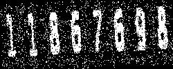
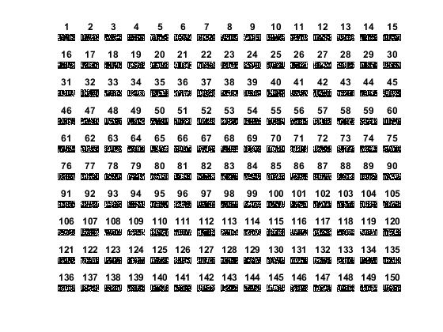

# image-processing-class

image processing class - 992

## Information

- ##### Teacher: Dr. Farzin Yaghmaee - [Contact](mailto:f_yaghmaee@semnan.ac.ir)
- ##### TA : Amir Shokri - [Contact](mailto:amirsh.nll@gmail.com)

### Student Info :

- Full name : Ehsan Majidi
- github id : EhsanMajidigithub

#=================================================================
#=================================================================
#=================================================================

<div dir="rtl">

###### پروژه ی دانشجویان گروه 2 (مجازی) <br/>

# برنامه ای بنویسید که بتواند کپچاهای سخت عددی تولید کند و نتواند توسط OCR نرم افزار متلب شناسایی شود و بتواند 150 نوع عکس کپچا در یک فایل ذخیره کند<br/>

---

---

---

---

---

###### شرح کدهای پروژه <br/>

  <p align="center">
      
  </p>

### در این برنامه سه تابع تعریف شده است که جهت فراخوانی در کد برنامه اصلی با نام capta.m استفاده شده است <br/>

- ### تابع FunctionSaveCaptcha <br/>
- ### تابع FunctionData <br/>
- ### تابع FunctionCaptcha <br/>

---

---

# تابع FunctionData : <br/>

عملکرد این تابع این است که جهت ایجاد داده های عددی مربوط به برنامه کپچا که مقدار 0 تا 9 می باشد

</div>

<div dir="ltr">

```matlab
function [ outnumber ] = FunctionData()

numbers(:,:,1) = dlmread("number\1.txt");
numbers(:,:,2) = dlmread("number\2.txt");
numbers(:,:,3) = dlmread("number\3.txt");
numbers(:,:,4) = dlmread("number\4.txt");
numbers(:,:,5) = dlmread("number\5.txt");
numbers(:,:,6) = dlmread("number\6.txt");
numbers(:,:,7) = dlmread("number\7.txt");
numbers(:,:,8) = dlmread("number\8.txt");
numbers(:,:,9) = dlmread("number\9.txt");
numbers(:,:,10) = dlmread("number\0.txt");

numbers = uint8(numbers);
outnumber = numbers;
end

```

<div dir="rtl">

## تحلیل دستورات FunctionData : <br/>

</div>

```
function [ outnumber ] = FunctionData()
```

<div dir="rtl">

#### نام تابع FunctionData را تعریف می کنیم و دارای یک پرامتر خروجی با نام outnumber است. <br/>

</div>

```
numbers(:,:,1) = dlmread("number\1.txt");
numbers(:,:,2) = dlmread("number\2.txt");
numbers(:,:,3) = dlmread("number\3.txt");
numbers(:,:,4) = dlmread("number\4.txt");
numbers(:,:,5) = dlmread("number\5.txt");
numbers(:,:,6) = dlmread("number\6.txt");
numbers(:,:,7) = dlmread("number\7.txt");
numbers(:,:,8) = dlmread("number\8.txt");
numbers(:,:,9) = dlmread("number\9.txt");
numbers(:,:,10) = dlmread("number\0.txt");
```

<div dir="rtl">

#### توسط numbers می توانیم مقدار ععدی را بر اساس dlmread که فایل های متنی را می خواند <br/>

</div>

```
numbers = uint8(numbers);

```

<div dir="rtl">

#### با استفاده از uint8 می توانیم مقادیر متنی را را به متغیر عددی تبدیل کنیم <br/>

</div>

```
numbers = uint8(numbers);

```

<div dir="rtl">

#### با استفاده از uint8 می توانیم مقادیر متنی را را به متغیر عددی تبدیل کنیم <br/>

</div>

```
outnumber = numbers;

```

<div dir="rtl">

#### متغیر عددی را به خروجی تابع ارجا می دهیم <br/>

</div>

---

---

<div dir="rtl">

# تابع FunctionCaptcha : <br/>

عملکرد این تابع این است که گپچاهای که دارای تصاویر نویز های فلفل و نمکی و نوع گاوسی و حالتی چرخشی داشته باشد </div>

<div dir="ltr">

```matlab
function [ outCaptcha] = FunctionCaptcha(count,n)

numbers_count = count;
numbers=n;
width = 500;
height = 200;

captcha_numbers = [ round(rand(1, numbers_count) * 10) - 1 ];
captcha_numbers = uint8(captcha_numbers);

captcha_image = zeros(size(numbers(:,:,1)));
captcha_image = numbers(:,:,1);

for i = 2 : numbers_count
    if captcha_numbers(1,i) == 0
        captcha_numbers(1,i) = 1;
    end
	captcha_image = [ captcha_image numbers(:,:,captcha_numbers(1,i)) ];
end

captcha_image = imresize(captcha_image, [height width]);

 captcha_image = imresize(captcha_image, [height/2 width/2]);

 captcha_image = imnoise(captcha_image,'gaussian',0,0.025);

 captcha_image=imnoise( captcha_image ,'salt & pepper', 0.2 );
 captcha_image = imbinarize(captcha_image, 0.3);


  A=randi([-5,5]);
  captcha_image= imrotate(captcha_image,A,'bilinear','crop');


 outCaptcha = captcha_image;

end

```

<div dir="rtl">

## تحلیل دستورات FunctionCaptcha : <br/>

</div>

```
function [ outCaptcha] = FunctionCaptcha(count,n)

```

<div dir="rtl">

#### با تعریف نام تابع FunctionCaptcha که به عنوان نام outCaptcha پارامتر خروجی که دارای دو مقدار برای داده ها و نوع تعداد حروف عددی کپچا استفاده می شود <br/>

</div>

```
numbers_count = count;
numbers=n;
width = 500;
height = 200;
```

<div dir="rtl">

#### مقدار طول و عرض کادر تصویر کپچا و تعداد نوع حروف کپچا توسط پارامتر ارجا تابع و مقادیر داده ها را مشخص می کند <br/>

</div>

```
captcha_numbers = [ round(rand(1, numbers_count) * 10) - 1 ];
captcha_numbers = uint8(captcha_numbers);

captcha_image = zeros(size(numbers(:,:,1)));
captcha_image = numbers(:,:,1);
```

<div dir="rtl">

#### حروف کپچا ها به صورت تصادفی ایجاد می شود <br/>

</div>

```
for i = 2 : numbers_count
    if captcha_numbers(1,i) == 0
        captcha_numbers(1,i) = 1;
    end
	captcha_image = [ captcha_image numbers(:,:,captcha_numbers(1,i)) ];
end
```

<div dir="rtl">

#### در کد زیر یک حلقه به تعداد حروف جهت عملیات هایی از جمله متد هایی که برای انجام آنها نیاز به تک تک کاراکترها می باشد ایجاد می کند . <br/>

</div>

```
captcha_image = imresize(captcha_image, [height width]);

 captcha_image = imresize(captcha_image, [height/2 width/2]);

 captcha_image = imnoise(captcha_image,'gaussian',0,0.025);

 captcha_image=imnoise( captcha_image ,'salt & pepper', 0.2 );
 captcha_image = imbinarize(captcha_image, 0.3);


  A=randi([-5,5]);
  captcha_image= imrotate(captcha_image,A,'bilinear','crop');
```

<div dir="rtl">

#### اعمال فیلترهای چرخش تصاویر کپچا و نویزهای فلفل نمکی همراه با نویزهای گاوسی متفاوت دیگر می باشد <br/>

</div>

---

---

<div dir="rtl">

# تابع FunctionSaveCaptcha : <br/>

عملکرد این تابع جهت ساخت تصاویر کپچاها درون یک پوشه در کنار برنامه کپچا استفاده می شود </div>

<div dir="ltr">

```
function  FunctionSaveCaptcha(numbers,count)


for i = 1:150
    [captcha_image] = FunctionCaptcha(count,numbers);
    imwrite(captcha_image, 'saveCapta\'+string(i)+'.jpg');
    subplot(10,15,i),imshow(captcha_image),title(i);

end

end
```

<div dir="rtl">

## تحلیل دستورات FunctionSaveCaptcha : <br/>

</div>

```
function  FunctionSaveCaptcha(numbers,count)
```

<div dir="rtl">

#### نام تابع FunctionData را تعریف می کنیم و دارای دو پارامتر دارد. <br/>

</div>

```
for i = 1:150
    [captcha_image] = FunctionCaptcha(count,numbers);
    imwrite(captcha_image, 'saveCapta\'+string(i)+'.jpg');
    subplot(10,15,i),imshow(captcha_image),title(i);

end

```

<div dir="rtl">

#### یک حلقه برای ایجاد تعداد 150 تصویر کپچا درون یک فایل با نام saveCapta کنار برنامه که فیلترها روی ان اعمال شده و ذخیره می شود <br/>

</div>

---

---

<div dir="rtl">

# Captcha : <br/>

این برنامه اصلی ما است و تمام توابع در اینجا فراخوانی می شود جهت سهولت و سادگی کدها از نظر خوانایی برنامه نسبت به پارامترهای داده ها که دارای مقادیر ورودی و خروجی است</div>

<div dir="ltr">

<div dir="ltr">

```matlab
clc;
close all;
clear;

numbers= FunctionData();
FunctionSaveCaptcha(numbers,8)
image=FunctionCaptcha(8,numbers);
figure;
imshow(image);
%ocr(image)
```

</div>

---

---

---

<div dir="rtl">

# نتیجه : <br/>

هدف از انجام ایجاد کپچاها که به صورت سخت ایجاد شود که توسط OCR نرم افزار متلب قابل شناسایی نباشد و درا ین برنامه شاید تعداد 2 الی 3 تا از تصاویر شناسسایی شود و باقیه را نمی تواند تشخیص دهد.</div>

<div dir="ltr">

<p align="center">
 
</p>
