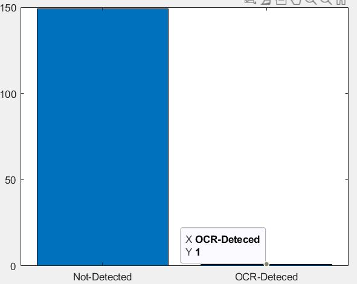

# image-processing-class
image processing class - 992

## Information
* ##### Teacher: Dr. Farzin Yaghmaee - [Contact](mailto:f_yaghmaee@semnan.ac.ir)
* ##### TA : Amir Shokri - [Contact](mailto:amirshokri@semnan.ac.ir)

### Student Info :
* Full name : Hossein Ommati
* github id : @ho88
* Email : hossein.ommati@gmail.com
* Type : Majazi

  
---
#### صورت مسئله پروژه نهایی 
برنامه ای که در تمرین شماره ی 10 در کلاس توسط بنده حل شده است را از پوشه ی class دانلود کنید و کارهای زیر را روی آن انجام دهید:
- روشی که انجام شده است را بهبود ببخشید
- بخش های مختلف این برنامه را به صورت تابع در فایل جداگانه بسازید و آن ها را ساده تر فراخوانی کنید.
- کپجاهای سخت تری ایجاد کنید فقط نکته اینکه از حوزه ی برنامه ی اولیه خارج نشوید
- 150 عکس با برنامه ی خود تولید کنید و آن را ذخیره کنید و بعد از ذخیره سازی آن در یک فایل خودتان با چشم کپچاها را تشخیص دهید و برچسب بزنید.
- خروجی تابع ocr و میزانی که متلب بتواند کپچای تصویری شما را شناسایی کند یکی از معیارهای مناسب برای سنجش برنامه ی شماست
- داکیومنت پروژه ی خود را Markdown مثل تمرین ها بسازید.
- روش هایی که انجام می دهید نباید بیش از 30 درصد با دوستان دیگر مشابهت داشته باشد.
- فایل های پروژه ی پایانی را از 25 اردیبهشت تا 30 اردیبهشت در گیت هاب آپلود کنید و خارج  از این بازه آپلود نکنید.
---

####  بررسی کد پروژه متلب
در این پروژه از یک تابع برای خواندن فایل‌های داده و ذخیره آن‌ها به عنوان یک فایل باینری و با فرمت سازگار با متغیر‌های متلب استفاده شده است.  
  همچنین در فایل final.m روند اصلی برنامه پیگیری شده است.  
  در این پروژه برای هر یک از عملیاتی که بر روی کپچا ایجاد می‌شود تا کپچا را سخت تر کند یک تابع در فایل جداگانه در نظر گرفته شده است.  
##### تابع read_data_files : 
  
یکی از مزیت‌های این تابع این است که داده‌ها را با فرمت باینری و به صورت متغیر‌های سازگار با متلب ذخیره می‌کند که تنها یکبار این کار انجام می‌شود و در دفعات بعدی اجرای برنامه، با سرعت بیشتری داده‌ها لود می‌شوند. مزیت دیگر این کار است که سرعت پیاده‌سازی را نیز بالا می‌برد. بطور مثال در مخازن اشتراک سورس کد و کار‌های تیمی مانند گیت‌هاب، یک فایل داده به اشتراک گذاشته می‌شود و دیگر دوستان تنها با فراخوانی و لود آن به تمام داده‌ها دسترسی دارند و نیازی به آدرس‌دهی و خواندن فایل‌های زیاد نیست.    
  در قطعه کد زیر داده‌ها در فایل data.mat ذخیره می‌شوند و هنگام استفاده در برنامه تنها با دستور load بارگیری می‌شوند.

~~~matlab
function [] = read_data_files()

files = dir('characters\*.txt');

for i=1 : length(files)
   
    filename = files(i).name;
    data(:,:,i) = dlmread("characters\"+filename);
    new_filename = filename(1:end-4);
    if strlength(new_filename)==2
       new_filename = new_filename(1); 
    end
    filenames(i) = new_filename;
end
clear i filename files new_filename
save data
end
~~~

  
##### تابع add_rotation : 
این تابع که وظیفه دوران سازی حروف کپچا را دارد بر روی هر یک از حروف ساخته شده در کپچا اعمال می‌شود. میزان دوران به صورت تصادفی از -30 درجه تا +30 درجه در نظر گرفته شده است.  

~~~matlab
function image = add_rotation(img)

rand_angle = randi([-30 30]);
image = imrotate(img, rand_angle,'bilinear','crop');

end
~~~

  
##### تابع add_noise : 
این تابع وظیفه ایجاد نویز در کل تصویر را بر عهده دارد. میزان تراکم نویز در فایل اصلی برنامه یعنی final.m با متغیر noise_density قابل تغییر است که از 0 تا 1 می‌تواند باشد.

~~~matlab
function image = add_noise(img, noise_density)

image = imnoise(img, 'salt & pepper', noise_density);

end
~~~

  
##### تابع add_shape : 
  این تابع وظیفه ساخت و ایجاد اشکال خط و دایره را در تصویر کپچا بر عهده دارد. می‌توان شکل‌های چند ضلعی هم به آن اضافه کرد. اما برای عدم تشخیص ربات‌ها اشکال خط و دایره کافی است و اضافه کردن اشکال دیگر تصویر کپچا را بیشتر برای عامل انسانی ناخوانا می‌کند. در این تابع بطور تصادفی از یک تا 7 خط با طول‌های تصادفی در تصویر کپچا ایجاد می‌شود و هم‌چنین از یک تا 4 دایره با اندازه شعاع تصادفی و با میزان عرض خطوط یک پیکسل در تصویر ایجاد می‌شود.

~~~matlab
function image = add_shape(img)

[height width] = size(img);
num_line = randi([1 7]);
image = img;
%add line
for i=1:num_line
   image = insertShape(image, 'Line', [randi([1 width]) randi([1 height]) randi([1 width]) randi([1 height])], 'LineWidth',1);
end

num_circle = randi([1 4]);
% add circle
for i=1:num_circle  
    image = insertShape(image, 'Circle', [randi([20 height-20]) randi([20 width-20]) randi([10 height/2])], 'LineWidth',1);
end

image = rgb2gray(image);
end
~~~

  
##### تابع ocr_detection : 
  این تابع وظیفه تشخیص حروف‌های ساخته شده در تصویر کپچا را بر عهده دارد که توسط تابع ocr متلب انجام می‌شود. سپس با استفاده از regular expression تمامی کاراکترهای فاصله و یا فضای خالی از متن تشخیص داده شده حذف شده است.

~~~matlab
function trimmed_ocr_text = ocr_detection(img)

ocr_text = ocr(img);
trimmed_ocr_text = regexprep(ocr_text.Text,'\s+','');

end
~~~

  
##### تابع add_blur : 
  این تابع وظیفه محو کردن کاراکترهای ایجاد شده در تصویر کپچا را بر عهده دارد. البته از این تابع در روند اصلی برنامه استفاده نشده است. چرا که در برخی موارد، با توجه به ساختار کاراکترها تغییرات زیادی بر روی کاراکتر رخ می‌دهد و ممکن است توسط عامل انسانی ناخوانا باشد. کار این تابع این است که یک فیلتر میانگین با پنجره فیلتر 3*3 در تصویر حروف اعمال کند.

~~~matlab
function filteredImage = add_blur(img)

filterWindow = ones(3) / 9;
filteredImage = imfilter(img, filterWindow);

end
~~~

  
##### تابع save_img : 
  این تابع 150 فایل تصویری کپچای ساخته شده را در پوشه out ذخیره می‌کند. نام پوشه‌های ذخیره و خروجی در فایل اصلی برنامه قابل تغییر و تنظیم است.

~~~matlab
function [] = save_img(folder_path, file_num, file_name)
    
    filename = sprintf('%d-%s.png',file_num, file_name);
    full_filename = fullfile(folder_path, filename);
    saveas(gcf, full_filename);
end
~~~

  
##### فایل اصلی برنامه final.m : 
  همانطور که قبلاً بیان شد، فایل اصلی برنامه است که روند اصلی برنامه در آن پیگیری می‌شود که هر قسمت آن بطور جداگانه توضیح داده می‌شود.

~~~matlab
clc;
close all;
clear;

% read_data_files();

load data

data = uint8(data);
image_count = 150;
row_plot = 15;
col_plot = 10;
data_count = length(data);
numbers_count = 5;
width = 500;
height = 200;
out_folder_path = 'out';

adding_noise = true;
adding_shape = true;
adding_rotation = true;
noise_density = 0.03;

subplot_all_img = false;
do_new_process = true;

correct_count = 0;

if do_new_process
   
    f = figure('visible', 'off');

    if subplot_all_img
       delete(fullfile(out_folder_path, '*.*'));
    end

for j=1 : image_count
   
    rand_nums = randi([1 data_count], 1, numbers_count);

    captcha_image = [];

    for i=1: length(rand_nums)

        img = data(:,:,rand_nums(i));
        if adding_rotation
            img = add_rotation(img);
        end
    %     if adding_blur
    %         img = add_blur(img);
    %     end
        captcha_image = [captcha_image img] 
        captcha_text(i) = filenames(rand_nums(i))
    end

    captcha_image = imresize(captcha_image, [height width]);

    if adding_noise
        captcha_image = add_noise(captcha_image, noise_density);
    end

    if adding_shape
        captcha_image = add_shape(captcha_image);
    end
    
    ocr_text = ocr_detection(captcha_image);
  
    
    dim1 = [0.15 0.13 1 0.1];
    dim2 = [0.15 0.05 1 0.1];
    dim3 = [0.6 0.13 0.05 0.1];
    
    
    imshow(im2bw(captcha_image, 0.3));

    annotation('textbox', dim1, ...
        'String', strcat('Original Captcha Text :', captcha_text), ...
        'Color', [1 0.5 0], ...
        'FontWeight', 'bold', ...
        'EdgeColor', 'none');

    annotation('textbox', dim2, ...
        'String', strcat('OCR Detected Text  : ', ocr_text), ...
        'Color', [0 0.5 0], ...
        'FontWeight', 'bold', ...
        'EdgeColor', 'none');
    if strlength(captcha_text)==strlength(ocr_text)
        if captcha_text == ocr_text
            an = annotation('ellipse', dim3, 'FaceColor', 'g', 'EdgeColor', 'g');
            correct_count = correct_count + 1;
        else
            an = annotation('ellipse', dim3, 'FaceColor', 'r', 'EdgeColor', 'r');
        end
    else
        an = annotation('ellipse', dim3, 'FaceColor', 'r', 'EdgeColor', 'r');
    end
    
    
    save_img(out_folder_path, j, captcha_text);
    
end

figure;

cats = categorical({'OCR-Deteced', 'Not-Detected'});
values = [correct_count image_count-correct_count];
bar(cats, values);

    
end

f = figure;
f.Position = [0 0 1500 1500];

if subplot_all_img
    
   img_files = dir(out_folder_path);
   cnt = 1;
   for i=1:length(img_files)
      if isfolder(img_files(i).name)
          continue;
      end
      
      I = imread(fullfile(out_folder_path,img_files(i).name));
       subplot(row_plot, col_plot, cnt);
       imshow(I);title(img_files(i).name);
       cnt = cnt + 1;
   end
    
end

disp('============== Process Done ===================')
~~~

  
  برای هر بخش از کد بالا توضیحاتی داده می‌شود.  
  

  

~~~matlab
clc;
close all;
clear;

% read_data_files();

load data
data = uint8(data);
~~~

  
متغیر‌های قبلی پاک می‌شوند و داده‌ها از فایل data.mat در برنامه لود می‌شوند. 
  

~~~matlab
image_count = 150;
row_plot = 15;
col_plot = 10;
data_count = length(data);
numbers_count = 5;
width = 500;
height = 200;
out_folder_path = 'out';

adding_noise = true;
adding_shape = true;
adding_rotation = true;
noise_density = 0.03;

subplot_all_img = false;
do_new_process = true;

correct_count = 0;
~~~

  
متغیر‌ها و تنظیمات برنامه مقداردهی اولیه می‌شوند. تعداد ساخت تصاویر کپچا، تعداد ریف و ستون‌ها plot ، تعداد حروف موجود در کپچا، اندازه تصویر کپچا، مسیر پوشه دخیره تصاویر، اعمال یا عدم اعمال توابع ذکر شده در بالا مانند نویز، ایجاد شکل، دوران و میزان نویز در تصویر و متغیر شمارشگر تشخیص صحیح تابع ocr 
  
  

~~~matlab
f = figure('visible', 'off');

    if subplot_all_img
       delete(fullfile(out_folder_path, '*.*'));
    end
~~~

  
  نمایش پنجره برای هر تصویر کدام از 150 تصویر ایجاد شده را خاموش کرده تا ففط تصویرها در پوشه خروجی ذخیره شوند. همچنین در صورتی که نیاز به نمایش تمامی کپچاها در یک پنجره به عنوان subplot باشد، فایل‌های تصویر قبلی ذخیره شده در مسیر خروجی همگی پاک می‌شوند. 
  

~~~matlab
for j=1 : image_count
   
    rand_nums = randi([1 data_count], 1, numbers_count);

    captcha_image = [];

    for i=1: length(rand_nums)

        img = data(:,:,rand_nums(i));
        if adding_rotation
            img = add_rotation(img);
        end
    %     if adding_blur
    %         img = add_blur(img);
    %     end
        captcha_image = [captcha_image img] 
        captcha_text(i) = filenames(rand_nums(i))
    end

    captcha_image = imresize(captcha_image, [height width]);

    if adding_noise
        captcha_image = add_noise(captcha_image, noise_density);
    end

    if adding_shape
        captcha_image = add_shape(captcha_image);
    end
    
    ocr_text = ocr_detection(captcha_image);
  
    
    dim1 = [0.15 0.13 1 0.1];
    dim2 = [0.15 0.05 1 0.1];
    dim3 = [0.6 0.13 0.05 0.1];
    
    
    imshow(im2bw(captcha_image, 0.3));

    annotation('textbox', dim1, ...
        'String', strcat('Original Captcha Text :', captcha_text), ...
        'Color', [1 0.5 0], ...
        'FontWeight', 'bold', ...
        'EdgeColor', 'none');

    annotation('textbox', dim2, ...
        'String', strcat('OCR Detected Text  : ', ocr_text), ...
        'Color', [0 0.5 0], ...
        'FontWeight', 'bold', ...
        'EdgeColor', 'none');
    if strlength(captcha_text)==strlength(ocr_text)
        if captcha_text == ocr_text
            an = annotation('ellipse', dim3, 'FaceColor', 'g', 'EdgeColor', 'g');
            correct_count = correct_count + 1;
        else
            an = annotation('ellipse', dim3, 'FaceColor', 'r', 'EdgeColor', 'r');
        end
    else
        an = annotation('ellipse', dim3, 'FaceColor', 'r', 'EdgeColor', 'r');
    end
    
    
    save_img(out_folder_path, j, captcha_text);
    
end

~~~

  
  حلقه for اول به تعداد 150 تصویر کپچا را قصد دارد ایجاد کند. برای هر تصویر 5 کاراکتر را به طور تصادفی از میان داده‌ها که تعداد آنها 62 تا است انتخاب می‌کند. عدد تصادفی انتخاب شده بیانگر اندیس داده است. 
  داده‌ها دو متغیر filenames و data را که در فایل data.mat است در خود جای داده‌اند. متغیر filenames کاراکترهای حروف را در بر دارد و data مقادیر پیکسلی هر کاراکتر را.  
  در حلقه for دوم به تعداد 5 کاراکتر با استفاده از اندیس‌های تصادفی از مقادیر data و filenames خوانده می‌شود که ترتیب مقادیر filenames ترتیب حروف واقعی کپچا را به ما می‌دهد.  
   
  

~~~matlab
    captcha_image = imresize(captcha_image, [height width]);

    if adding_noise
        captcha_image = add_noise(captcha_image, noise_density);
    end

    if adding_shape
        captcha_image = add_shape(captcha_image);
    end
    
    ocr_text = ocr_detection(captcha_image);
~~~

  
  در خط اول تصویر اندازه آن طبق مقادیر اولیه تغییر می‌یابد. در شرط if اول نویز به تصویر اضافه می‌شود و در شرط if دوم شکل ‌های خط و دایره به تصویر اضافه می‌شود. سپس در خط آخر تابع ocr کاراکترها شناسایی می‌کند و متن بازگردانده شده در ocr_text ذخیره می‌شود. 
  

~~~matlab
     dim1 = [0.15 0.13 1 0.1];
    dim2 = [0.15 0.05 1 0.1];
    dim3 = [0.6 0.13 0.05 0.1];
    
    
    imshow(im2bw(captcha_image, 0.3));

    annotation('textbox', dim1, ...
        'String', strcat('Original Captcha Text :', captcha_text), ...
        'Color', [1 0.5 0], ...
        'FontWeight', 'bold', ...
        'EdgeColor', 'none');

    annotation('textbox', dim2, ...
        'String', strcat('OCR Detected Text  : ', ocr_text), ...
        'Color', [0 0.5 0], ...
        'FontWeight', 'bold', ...
        'EdgeColor', 'none');
    if strlength(captcha_text)==strlength(ocr_text)
        if captcha_text == ocr_text
            an = annotation('ellipse', dim3, 'FaceColor', 'g', 'EdgeColor', 'g');
            correct_count = correct_count + 1;
        else
            an = annotation('ellipse', dim3, 'FaceColor', 'r', 'EdgeColor', 'r');
        end
    else
        an = annotation('ellipse', dim3, 'FaceColor', 'r', 'EdgeColor', 'r');
    end
    
    
    save_img(out_folder_path, j, captcha_text);
~~~

  
  تصویر در پنجره نمایش داده می‌شود و 3 تا annotation  به تصویر اضافه می‌شود که متن اصلی کپچا و متن شناسایی شده توسط ocr و همچنین یک دایره به رنگ‌های سبز یا قرمز هستند. در صورتی که دایره قرمز باشد به این معنی است که ocr به درستی تشخیص نداده است و در صورت دایره سبز به این معنی است که به درستی توسط ocr تشخیص داده شده است. در خط آخر نیز تصویر موجود در پنجره در مسیر پوشه خروجی ذخیره می‌شوند. 
  نمونه‌ای از تصویر خروجی را می‌بینید.   
  

  
  <h4 align="center"> نمونه تصویر کپچا و متن‌های اصلی و تشخیصی ocr</h4>

~~~matlab
     figure;

cats = categorical({'OCR-Deteced', 'Not-Detected'});
values = [correct_count image_count-correct_count];
bar(cats, values);
~~~

  
  چارت مقایسه میزان تشخیص تابع ocr نسبت به کل تصاویر کپچای ایجاد شده نمایش داده می‌شود. 
  

~~~matlab
  f = figure;
  f.Position = [0 0 1500 1500];

  if subplot_all_img

     img_files = dir(out_folder_path);
     cnt = 1;
     for i=1:length(img_files)
        if isfolder(img_files(i).name)
            continue;
        end

        I = imread(fullfile(out_folder_path,img_files(i).name));
         subplot(row_plot, col_plot, cnt);
         imshow(I);title(img_files(i).name);
         cnt = cnt + 1;
     end

  end
~~~

  
  در صورت فعال کردن رسم subplot  و نمایش همه تصاویر در یک پنجره تصاویر موجود در پوشه خروجی دوباره لود می‌شوند و در یک پنجره نمایش داده می‌شوند.    
  

---

  
####  بررسی نتایج

  

  
  <h4 align="center"> نتیجه خروجی بدون اعمال هیچ تابعی بر روی 150 تصویر کپچا  </h4>

---

  
  <h4 align="center"> نتیجه خروجی اعمال تابع نویز برای 150 تصویر کپچا </h4>

---

  
  <h4 align="center"> نتیجه خروجی اعمال تابع اضافه کردن شکل برای 150 تصویر کپچا </h4>

---

  
  <h4 align="center"> نتیجه خروجی اعمال تابع دوران‌سازی حروف برای 150 تصویر کپچا </h4>

---

  
  <h4 align="center"> نتیجه خروجی ترکیب تمامی توابع دستکاری تصویر برای 150 تصویر کپچا </h4>

---

  <h3 align="center">  با تشکر از توجه شما  </h3>

