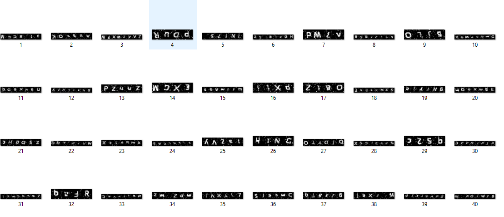
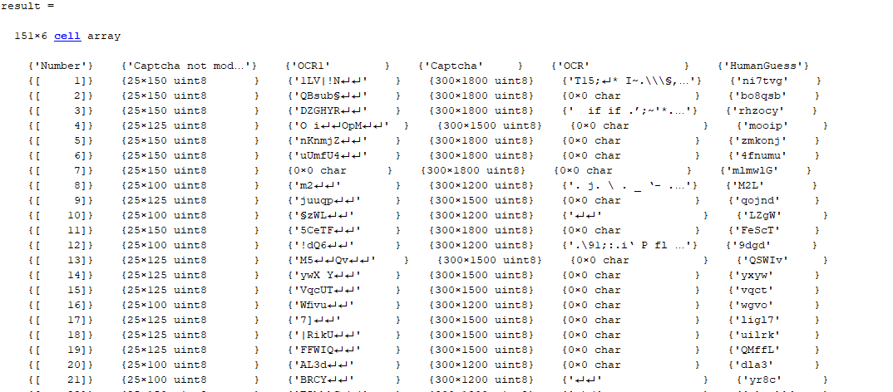

# image-processing-class

image processing class - 992

## Information

- ##### Teacher: Dr. Farzin Yaghmaee - [Contact](mailto:f_yaghmaee@semnan.ac.ir)
- ##### TA : Amir Shokri - [Contact](mailto:amirsh.nll@gmail.com)

### Student Info :

- Full name : ---
- github id : ---
- Email : ---
- Type : ---

<div dir="rtl">
 
 <h1> تمرین نهایی</h1>
 <hr>
 
 <h3> برنامه ای که در تمرین شماره ی 19 در کلاس توسط بنده حل شده است را از پوشه ی class دانلود کنید و کارهای زیر را روی آن انجام دهید:</h3>  
<ul>
 <li> روشی که انجام شده است را بهبود ببخشید.</li>
 <li>بخش های مختلف این برنامه را به صورت تابع در فایل جداگانه بسازید و آن ها را ساده تر فراخوانی کنید.
</li>
 <li>کپجاهای سخت تری ایجاد کنید فقط نکته اینکه از حوزه ی برنامه ی اولیه خارج نشوید
</li>
 <li>
  150 عکس با برنامه ی خود تولید کنید و آن را ذخیره کنید و بعد از ذخیره سازی آن در یک فایل خودتان با چشم کپچاها را تشخیص دهید و برچسب بزنید.
  </li>
 <h6>خروجی تابع ocr   و میزانی که متلب بتواند کپچای تصویری شما را شناسایی کند یکی از معیارهای مناسب برای سنجش برنامه ی شماست</h6>

</ul>
</div>

<div dir="rtl">
 پاک کردن command window و صفحه نمایش و بسته نمودن پنجره ها
 </div>
 
````
clc;
close all;
clear;
````
 <div dir="rtl">
استفاده از متغیر Result برای ذخیره نمودن 150 عکس خروجی و تعیین فیلد های زیر:
 <ul>
  <li>Number: شماره عکس</li>
  <li>Captcha not modify:کپچایی که تغییر پیدا نکرده است</li>
  <li>OCR1:تشخیص OCR قبل از اینکه تغییرات اصلی روی آن اعمال شود</li>
  <li>Captcha:کپچای تغییر یافته</li>
  <li>OCR:تشخیص OCR از روی کپچای تغییر یافته</li>
  <li>HumanGuess:حدس انسان</li>
 </ul>
 
</div>

```
result = cell(150,6);
result(1,:)={'Number','Captcha not modify','OCR1','Captcha','OCR','HumanGuess'};
```

 <div dir="rtl">
تعداد کاراکتر های تصویر کپچا اعدادی بین 4 تا 6 مشخص می شود. اندازه تصویر خروجی کپچا نیز بر این اساس تعیین می شود.<br>
 captcha_image2 نیز برای مشخص کردن کپچای بدون تغییر می باشد.</br>
 <h4>توسط تابع get_alphabet  تصاویر هریک از کاراکتر های کپچا تولید می شود 
</h4>
</div>
 
 ````
 for j = 1: size(result,1)
alphabet_count = randi([4,6]);
width = 300*alphabet_count;
height = 300;
captcha_alphabet = [ randi([1 62],1,alphabet_count,'uint8'); ];
captcha_alphabet = uint8(captcha_alphabet);
alphabet=get_alphabet();
captcha_image = zeros(size(alphabet(:,:,1)));

captcha_image = alphabet(:,:,captcha_alphabet(1,1));
captcha_image2 = alphabet(:,:,captcha_alphabet(1,1));

```
<div dir="rtl">

اعمال یکسری توابع به نام های rotate،medfilt2،noiseو insert_line  به کپچای تولید شده به منظور تشخیص سخت تر OCR متلب.

 </div>

```

for i = 2 : alphabet_count
captcha_image = [ captcha_image alphabet(:,:,captcha_alphabet(1,i)) ];
captcha_image2 = [ captcha_image2 alphabet(:,:,captcha_alphabet(1,i)) ];
[m ,n ] = size(captcha_image);
captcha_image = rotate(captcha_image, m,n);  
end
%captcha_image = medfilt2(captcha_image);
captcha_image = noise(captcha_image);
captcha_image = insert_line(captcha_image, height ,width);
captcha_image = imresize(captcha_image, [height width]);

```
<div dir="rtl">
 ذخیره کپجای های تولید شده در پوشه result و تشخیص OCR از روی هم کپچای تغییر یافته و هم کپچای بدون تغییر </br>

 </div>

```

str = sprintf('%d ', j);
image = ['result\' str '.png'];
image2 = ['result2\' str '.png'];
figure(1);
imwrite(captcha_image,image)
imwrite(captcha_image2,image);
resulu_o=ocr(captcha_image);
result_Ocr = resulu_o.Text;
resulu_o2=ocr(captcha_image2);
result_Ocr2 = resulu_o2.Text;

```
<div dir="rtl">
 نمایش کپچا و از کار خواسته شده است تا حدس خود را از کپچا وارد نماید.</br>

 <h6> ذخیره نتایج در آرایه سلولی تعریف شده در بالا</h6>
 </div>

```

figure(1);
imshow(im2bw(captcha_image, 0.3));
figure(2);
imshow(im2bw(captcha_image2, 0.3));
disp(num2str(j));
HumanGuess = input('What do you guess? ' , 's');

result(j+1,1) ={j};
result(j+1,2)= {captcha_image2};
result(j+1,3)= {resulu_o2};
result(j+1,4) ={captcha_image};
result(j+1,5) ={result_Ocr};
result(j+1,6) ={HumanGuess};

end
save('result.mat','result');

```
<hr>
<hr>

<center><h2 dir="rtl"> توابع استفاده شده در کد</h2></center>

<hr>
<hr>
<div dir="rtl">
 <h3> get_alphabet</h3>
 توسط این تابع تصاویر مورد نیاز کپچای تولید می شوند
 </div>

```

function [alphabet] = get_alphabet()
alphabet(:,:,1) = dlmread("alphabet\A.txt");
alphabet(:,:,2) = dlmread("alphabet\B.txt");
alphabet(:,:,3) = dlmread("alphabet\C.txt");
alphabet(:,:,4) = dlmread("alphabet\D.txt");
alphabet(:,:,5) = dlmread("alphabet\E.txt");
alphabet(:,:,6) = dlmread("alphabet\F.txt");
alphabet(:,:,7) = dlmread("alphabet\G.txt");
alphabet(:,:,8) = dlmread("alphabet\H.txt");
alphabet(:,:,9) = dlmread("alphabet\I.txt");
alphabet(:,:,10) = dlmread("alphabet\J.txt");
alphabet(:,:,11) = dlmread("alphabet\K.txt");
alphabet(:,:,12) = dlmread("alphabet\L.txt");
alphabet(:,:,13) = dlmread("alphabet\M.txt");
alphabet(:,:,14) = dlmread("alphabet\N.txt");
alphabet(:,:,15) = dlmread("alphabet\O.txt");
alphabet(:,:,16) = dlmread("alphabet\P.txt");
alphabet(:,:,17) = dlmread("alphabet\Q.txt");
alphabet(:,:,18) = dlmread("alphabet\R.txt");
alphabet(:,:,19) = dlmread("alphabet\S.txt");
alphabet(:,:,20) = dlmread("alphabet\T.txt");
alphabet(:,:,21) = dlmread("alphabet\U.txt");
alphabet(:,:,22) = dlmread("alphabet\V.txt");
alphabet(:,:,23) = dlmread("alphabet\W.txt");
alphabet(:,:,24) = dlmread("alphabet\X.txt");
alphabet(:,:,25) = dlmread("alphabet\Y.txt");
alphabet(:,:,26) = dlmread("alphabet\Z.txt");
alphabet(:,:,27) = dlmread("alphabet\a1.txt");
alphabet(:,:,28) = dlmread("alphabet\b1.txt");
alphabet(:,:,29) = dlmread("alphabet\c1.txt");
alphabet(:,:,30) = dlmread("alphabet\d1.txt");
alphabet(:,:,31) = dlmread("alphabet\e1.txt");
alphabet(:,:,32) = dlmread("alphabet\f1.txt");
alphabet(:,:,33) = dlmread("alphabet\g1.txt");
alphabet(:,:,34) = dlmread("alphabet\h1.txt");
alphabet(:,:,35) = dlmread("alphabet\i1.txt");
alphabet(:,:,36) = dlmread("alphabet\j1.txt");
alphabet(:,:,37) = dlmread("alphabet\k1.txt");
alphabet(:,:,38) = dlmread("alphabet\l1.txt");
alphabet(:,:,39) = dlmread("alphabet\m1.txt");
alphabet(:,:,41) = dlmread("alphabet\n1.txt");
alphabet(:,:,42) = dlmread("alphabet\o1.txt");
alphabet(:,:,43) = dlmread("alphabet\p1.txt");
alphabet(:,:,44) = dlmread("alphabet\q1.txt");
alphabet(:,:,45) = dlmread("alphabet\r1.txt");
alphabet(:,:,46) = dlmread("alphabet\s1.txt");
alphabet(:,:,47) = dlmread("alphabet\t1.txt");
alphabet(:,:,48) = dlmread("alphabet\u1.txt");
alphabet(:,:,49) = dlmread("alphabet\v1.txt");
alphabet(:,:,50) = dlmread("alphabet\w1.txt");
alphabet(:,:,51) = dlmread("alphabet\x1.txt");
alphabet(:,:,52) = dlmread("alphabet\y1.txt");
alphabet(:,:,53) = dlmread("alphabet\z1.txt");
alphabet(:,:,54) = dlmread("alphabet\0.txt");
alphabet(:,:,55) = dlmread("alphabet\1.txt");
alphabet(:,:,56) = dlmread("alphabet\2.txt");
alphabet(:,:,57) = dlmread("alphabet\3.txt");
alphabet(:,:,58) = dlmread("alphabet\4.txt");
alphabet(:,:,59) = dlmread("alphabet\5.txt");
alphabet(:,:,60) = dlmread("alphabet\6.txt");
alphabet(:,:,61) = dlmread("alphabet\7.txt");
alphabet(:,:,62) = dlmread("alphabet\8.txt");
alphabet(:,:,63) = dlmread("alphabet\9.txt");

alphabet = uint8(alphabet);
end

```

<div dir="rtl">
 <h3> rotate</h3>
چرخش تصویر توسط این تابع و دوباره تنظیم نمودن اندازه آن
</div>

```

function captcha_image = rotate(captcha_image, m ,n)
M = randi([179 , 181]);
captcha_image = imrotate(captcha_image,M);
captcha_image = imresize(captcha_image, [m n]);
end

```

<div dir="rtl">
 <h3> noise</h3>

 ایجاد نویز فلفل نمکی روی تصویر توسط این تابع
</div>

```

function captcha_image = noise(captcha_image)
captcha_image = imnoise(captcha_image , 'salt & pepper' , 0.05);
end

```


<div dir="rtl">
 <h3> noise</h3>

 ایجاد خط های تصادفی </div>

```

function image = insert_line(image, m ,n)
M = randi([4,6]);
for i=1:M
size=randi([50 , 200]);
p = max(size);
mm= randi([10, m-p]);
nn= randi([10, n-p]);
start=[mm,nn];

y=start(1)+size;
for x =round(size/2) : size-1
image(start(1)+1,start(2)+x)=255;
y=y-1;
end
end
M = randi([4,6]);
for i=1:M
size=randi([50 , 200]);
p = max(size);
mm= randi([10, m-p]);
nn= randi([10, n-p]);
start=[mm,nn];

y=start(1)+size;
for x =1 : round(size/2)
image(start(1)+x,start(2)+x)=255;
y=y-1;
end
end
M = randi([4,6]);
for i=1:M
size=randi([50 , 200]);
p = max(size);
mm= randi([10, m-p]);
nn= randi([10, n-p]);
start=[mm,nn];

y=start(1)+size;
for x =1 : round(size/2)
image(y,start(2)+x)=255;
y=y-1;
end
end
end

```

<div dir="rtl">
 <h3> نمایش خروجی</h3>
 <p align="center">


  <h3 align="center">بخشی از 150 تصویر تولید شده</h3>
</p>

 <p align="center">


  <h3 align="center">بخشی از نتایج ذخیره شده در آرایه Result</h3>
</p>

</div>
```
