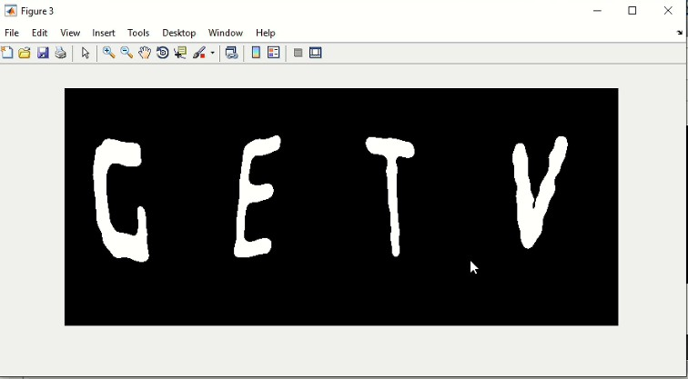
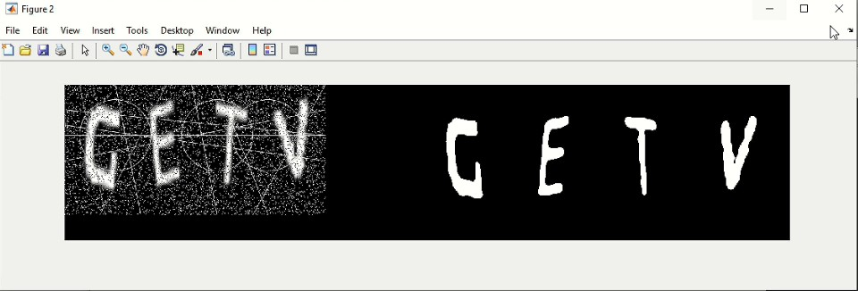
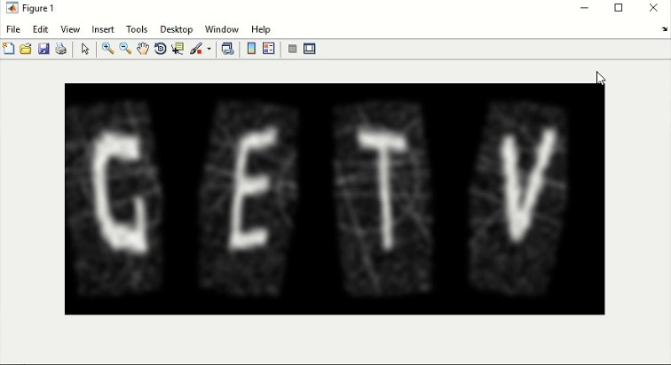
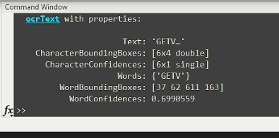
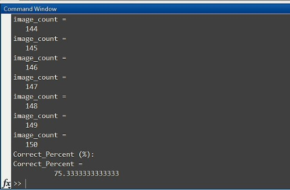

<div dir="rtl">
  
# ابتدا با فایل exr_19_modify.m  شروع می کنیم 
<br/>

#### با این دستور، تصاویر حروف الفبا را از پوشه دریافت می کنیم:
<br/>
</div>

```
address = 'C:/Users/kam/Desktop/New folder (4)/';
```
<div dir="rtl">
تعداد حروف کپچا را با دستور زیر مشخص می کنیم. برای این تمرین ما تعداد 4 را در نظر گرفتیم.
</div>

```
alphabet_count = 4;
```
<div dir="rtl">
ابعاد کپچا را نیز درون متغیر های زیر قرار می دهیم
</div>

```
width = 512;
height = 256;
```

<div dir="rtl">
در مرحله بعد تابع Read_Alphabet را اعمال می کنیم تا حروف ما درون متغیر alphabet ذخیره شوند و تعداد حروف و اسامی آن ها را استخراج کنیم:
</div>

```
[image_name, image_count, alphabet] = Read_Alphabet(address);
```

<div dir="rtl">
برای اینکه اعداد متوالی پشت سر هم نداشته باشیم، یک متغیر به نام Consecutive_numbers تعریف می کنیم:
</div>

```
Consecutive_numbers = 1;
```

<div dir="rtl">
در ادامه، یک حلقه تعریف می کنیم و شرط ادامه آن را به صورت زیر تعریف می کنیم:
</div>

```
while Consecutive_numbers == 1
```
<div dir="rtl">
دستورات درون حلقه، 4 عدد تصادفی غیر تکراری تولید می کنند که احتمال دارد این اعداد متوالی باشند. برای اینکه این اتفاق نیفتد، یک حلقه دیگر ایجاد می کنیم که از این اتفاق جلوگیری کند:
</div>

```
    captcha_alphabet = unique_random_num_captcha(alphabet_count, image_count);
    for r=1:alphabet_count-1
        if abs(captcha_alphabet(r+1) - captcha_alphabet(r)) == 1
            break
        else
            Consecutive_numbers = 0;
        end
    end
end
```

<div dir="rtl">
راه دیگر سخت تر کردن کپچا این است که حروف الفبا را چرخش دهیم. برای این کار، ما سه روش در اختیار داریم:nearest، bilinear و bicubic.
  اگر مقدار MTD را برابر 3 قرار دهیم، به این معنی است که از متد سوم استفاده می کنیم.
</div>

```
alphabet_size = size(alphabet(:,:,1));


method = {'nearest', 'bilinear', 'bicubic'};
MTD=3;
angle = 0;

captcha_image_r = Create_Captcha_Image(alphabet_count, captcha_alphabet, image_count, alphabet, method, MTD, height, width);
```

<div dir="rtl">
در مرحله بعد برای سخت تر کردن کپچا، به آن نویز اضافه می کنیم. می توانیم از نویز های poisson،gaussian، salt & pepper و speckle استفاده کنیم که در اینجا، ما از نویز فلفل و نمک با شدت 0.2 استفاده کردیم: 
</div>

```
Noise = {'poisson', 'gaussian', 'salt & pepper', 'speckle'};
captcha_image_r = imnoise(captcha_image_r,Noise{3},.2);
```
<div dir="rtl">
در مرحله بعد، می خواهیم خطوطی را برای سخت تر کردن کپچا به آن اضافه کنیم. ضخامت خط را با استفاده از متغیر LineWidth مشخص می کنیم. تابع Line_Draw نیز خطوط را به تصویر اضافه می کند:
</div>

```
LineWidth = 1;

captcha_image_r = Line_Draw(captcha_image_r, width, height, LineWidth);
```

<div dir="rtl">
پس از اضافه کردن خطوط، روی تصویر کپچا یک فیلتر اعمال می کنیم. در ابتدا اندازه فیلتر را با متغیر Filter_size مشخص می کنیم. 
</div>

```
Filter_size = 13;
NR_captcha_image_r = Filter_Captcah_Image(height, width, alphabet_count, method, captcha_image_r, Filter_size);

% NR_captcha_image_r = imgaussfilt(NR_captcha_image_r,2);
% NR_captcha_image_r = imsharpen(NR_captcha_image_r,'Radius',2,'Amount',1);
```

<div dir="rtl">
برای کامل کردن عملیات فیلتر تصویر را به باینری تبدیل می کنیم. مقدار آستانه را نیز 0.5 قرار دادیم. با استفاده از دستور imshowpair می توانیم دو تصویر را در کنار همدیگر نمایش دهیم که در اینجا، دو تصویر فیلتر شده و نویزی را با هم نمایش می دهد.
</div>

```
bw = .5;

figure()
imshow(NR_captcha_image_r)

figure()
imshowpair(captcha_image_r,im2bw(NR_captcha_image_r, bw),'montage')
```

<div dir="rtl">
در ادامه، با استفاده از تابع ocr تصویر ساخته شده را می خوانیم و خروجی تابع را درون یک متغیر به نام txt قرار می دهیم:
</div>

```
txt = ocr(im2bw(NR_captcha_image_r, bw))
```

<div dir="rtl">
برای نمایش تصاویر حاصل از توابع این برنامه، از دستور زیر استفاده می کنیم:
</div>

```
figure()
img = im2bw(NR_captcha_image_r, bw);
imshow(img)
```

<div dir="rtl">
با اجرای برنامه بالا، خروجی های زیر حاص می شود:
</div>

<p align="center">
      
</p>
<p align="center">
      
</p>
<p align="center">
      
</p>
<p align="center">
      
</p>

****
****
****
****
****

<div dir="rtl">
  
  # معرفی تابع Read_Alphabet.m
</div>

<div dir="rtl">
  
  #### این تابع، پارامتر address را می گیرد و سه پارامتر برمی گرداند:
</div>

```
function [image_name, image_count, alphabet] = Read_Alphabet(address)
```

<div dir="rtl">
  
  #### در ادامه، ما نیاز داریم که از داخل آدرس، فایل های متنی را بخوانیم. برای ساده تر کردن و بهبود روشی که در فایل اصلی تمرین آورده شده، از دستور دایرکتوری (dir) استفاده کردیم و تمام فایل ها را در متغیر D ذخیره کردیم:
</div>

```
D = dir(address);
```

<div dir="rtl">
  
  #### برای اینکه که بعد از اجرای حلقه for تعداد تکرار های حلقه را بشماریم، از متغیر زیر استفاده می کنیم: 
</div>

```
image_count = 1;
```
<div dir="rtl">
  
  #### از متغیر alphabet  برای این منظور استفاده می کنیم که تک تک فایل های متنی تصاویر در آن ذخیره شوند. از آن جایی که سایز هر تصویر 25 در 25 است و تعداد تصاویر هم 26 عدد است، پارامتر های این متغیر به صورت زیر تعریف می شوند. این کار زمان اجرای کد قبلی را نیز کاهش می دهد چرا که از همان ابتدا، ابعاد تصاویر را مشخص می کنیم: 
</div>

```
alphabet = zeros(25,25,26);
```

<div dir="rtl">
  
  #### برای ذخیره سازی اسامی تصاویر، یک سلول تعریف می کنیم: 
</div>

```
image_name = cell(1,26);
```

<div dir="rtl">
  
  #### در ادامه، یک حلقه for درست می کنیم که از 1 تا سایز D اجرا شود. ممکن است در پوشه ما، به جز فایل های متنی، فایل های دیگری وجود داشته باشند... 
</div>

```
for i=1 : size(D,1)
```

<div dir="rtl">
  
  #### اسامی آیتم ها را در داخل متغیر NAME ذخیره می کنیم: 
</div>

```
Name = D(i).name;
```


<div dir="rtl">
  
  #### با استفاده از دستور strfind، فایل هایی که پسوند txt دارند را درون متغیر find ذخیره می کنیم: 
</div>

```
find = strfind(Name, '.txt');
```

<div dir="rtl">
  
  #### حال برای اینکه همه اسامی وارد alphabet نشوند باید یک شرط تعیین کنیم. اول از همه، دستور isempty فایل را بررسی می کند که آیا خالی است یا نه، پس مقدار متغیر empty  باید برابر با 0 باشد  
</div>

```
empty = isempty(find);
```

<div dir="rtl">
  
  #### زمانی که تابع بتواند فایل متنی را پیدا کند، عدد 2 را بر میگرداند. در نتیجه باید عددی باشد. برای چک کردن عددی بودن آن یک متغیر به اسم num تعریف می کنیم از دستور isnumeric استفاده می کنیم که در صورت پیدا کردن فایل متنی، باید مقدارش 1 (به معنی عددی بودن) باشد: 
</div>

```
 num = isnumeric(find);
```

<div dir="rtl">
  
  #### درون شرط، با استفاده از دستور dlmread می توانیم هر کدام از فایل های متنی را بخوانیم و در alphabet ذخیره می کنیم. دستور strcat دو رشته را به هم الحاق می کند. این دستور به خاطر این استفاده می شود که اسم های داخل آدرس را بخواند.  
</div>

```
alphabet(:,:,image_count) = dlmread(strcat(address,Name));
```

<div dir="rtl">
  
  #### برای ذخیره سازی اسامی در سلول خالی که تعریف کرده بودیم نیز از دستور زیر استفاده می کنیم: 
</div>

```
 image_name{image_count} = Name(1);
```

<div dir="rtl">
  
  #### در پایان حلقه، یکی به شمارنده اضافه می شود: 
</div>

```
image_count = image_count + 1;
```

<div dir="rtl">
  
  #### چون image_count از 1 شروع شده بود، در پایان کار حلقه, عدد آن یکی بیشتر از آن چیزی که باید باشد، می شود. برای همین، از دستور زیر استفاده می کنیم: 
</div>

```
image_count = image_count - 1;
```

<div dir="rtl">
  
  #### در انتها، با استفاده از دستور uint8 یعنی اعداد بدون علامت 8 بیتی، تصویری که در اختیار داریم را از دابل به uint8 تغییر حالت می دهیم: 
</div>

```
alphabet = uint8(alphabet);
```

****
****
****
****
****

<div dir="rtl">
  
  # معرفی تابع unique_random_num_captcha.m
</div>

<div dir="rtl">
  
  #### این تابع تعداد حروف الفبا و تعداد تصاویر را دریافت می کند: 
</div>

```
function captcha_alphabet = unique_random_num_captcha(alphabet_count, image_count)
```

<div dir="rtl">
  
  #### با استفاده از دستور randperm تعدادی عدد تصادفی غیر تکراری تولید می کنیم و متغیر هایی که این دستور دریافت می کند، تعداد تصاویر و تعداد حروف الفبا هستند :
</div>

```
captcha_alphabet = [randperm(image_count,alphabet_count)];
```

<div dir="rtl">
  
  ####  قطعه کد زیر، حروف را به uint8 تبدیل می کند و آن را درون متغیر captcha_alphabet ذخیره می کند: 
</div>

```
captcha_alphabet = uint8(captcha_alphabet);
```

****
****
****
****
****

<div dir="rtl">
  
  # معرفی تابع Create_Captcha_Image.m
</div>

<div dir="rtl">
  
  ####  ورودی های این تابع عبارتند از: alphabet_count، captcha_alphabet، image_count، alphabet، method، MTD، height و width: 
</div>

```
function captcha_image_r = Create_Captcha_Image(alphabet_count, captcha_alphabet, image_count, alphabet, method, MTD, height, width)
```


captcha_image_r = zeros(25,25*alphabet_count);

<div dir="rtl">
  
  #### حلقه ای از 1 تا 4 ایجاد می کنیم: 
</div>

```
for i = 1 : alphabet_count
```

<div dir="rtl">
  
  #### برای اینکه بررسی کنیم که بازه اعداد بین 1 تا 26 است از قطعه کد زیر استفاده می کنیم: 
</div>

```
    if captcha_alphabet(1,i) < 1
        captcha_alphabet(1,i) = 1;
    end
    if captcha_alphabet(1,i) > image_count
        captcha_alphabet(1,i) = image_count;
    end
```
 <div dir="rtl">
  
  #### برای چرخش، ابتدا اندیس های زوج و فرد را جدا کرده و زوج ها را با 9 درجه و فرد ها را با زاویه -10 درجه استفاده می کنیم: 
</div>
 
```
    if rem(i,2) == 0
        angle = 9;
    else
        angle = -10;
    end
```
    
<div dir="rtl">
  
  #### دستور زیر، حروف الفبای انتخاب شده را با استفاده از تابع imrotate و با زاویه i+angle چرخش داده و آن ها را درون متغیر captcha_image_r ذخیره می کند: 
</div>

```
    captcha_image_r(:,(25*i)-24:25*i) = imrotate(alphabet(:,:,captcha_alphabet(1,i)),i+angle,'crop',method{MTD});
end
```

    
<div dir="rtl">
  
  #### در نهایت تصویر را به uint8 تبدیل کرده و سایز تصویر را به 256 در 512 تغییر می دهیم تا تابع ocr بهتر بتواند تصویر را بخواند: 
</div>

```
captcha_image_r = uint8(captcha_image_r);

captcha_image_r = imresize(captcha_image_r, [height width]);
end
```

****
****
****
****
****

<div dir="rtl">
  
  # معرفی تابع Line_Draw.m
</div>

<div dir="rtl">
  
  #### این تابع، تصویر، طول و عرض و ضخامت خط را دریافت می کند: 
</div>

```
function captcha_image_r = Line_Draw(captcha_image_r, width, height, LineWidth)
```

<div dir="rtl">
  
  #### با استفاده از دستور insertShape، می توانیم خط یا دایره و یا اشکال مختلف را ایجاد کرده و به کپچا اضافه کنیم. برای خط از پارامتر های x1، x2، y1 و y2 استفاده می کنیم. برای دایره نیز از پارامتر های x و y که مرکز دایره هستند و r که شعاع دایره است استفاده می کنیم. می توانیم رنگ خطوط و دایره ها را به انتخاب تغییر دهیم:
</div>

```
captcha_image_r = insertShape(captcha_image_r,'Line',[1 50 width 100],'LineWidth',LineWidth, 'color','yellow');
captcha_image_r = insertShape(captcha_image_r,'Line',[1 150 width 50],'LineWidth',LineWidth, 'color','yellow');
captcha_image_r = insertShape(captcha_image_r,'Line',[1 100 width 100],'LineWidth',LineWidth, 'color','yellow');
captcha_image_r = insertShape(captcha_image_r,'Line',[1 80 width 150],'LineWidth',LineWidth, 'color','yellow');
captcha_image_r = insertShape(captcha_image_r,'Line',[30 1 80 height],'LineWidth',LineWidth, 'color','green');
captcha_image_r = insertShape(captcha_image_r,'Line',[100 1 150 height],'LineWidth',LineWidth, 'color','yellow');
captcha_image_r = insertShape(captcha_image_r,'Line',[200 1 70 height],'LineWidth',LineWidth, 'color','green');
captcha_image_r = insertShape(captcha_image_r,'Line',[250 1 300 height],'LineWidth',LineWidth, 'color','yellow');
captcha_image_r = insertShape(captcha_image_r,'Line',[300 1 400 height],'LineWidth',LineWidth, 'color','yellow');
captcha_image_r = insertShape(captcha_image_r,'Line',[width 1 370 height],'LineWidth',LineWidth, 'color','yellow');

captcha_image_r = insertShape(captcha_image_r,'Circle',[100 100 70],'LineWidth',LineWidth, 'color','yellow');
captcha_image_r = insertShape(captcha_image_r,'Circle',[300 100 70],'LineWidth',LineWidth, 'color','yellow');
captcha_image_r = insertShape(captcha_image_r,'Circle',[400 100 70],'LineWidth',LineWidth, 'color','yellow');
```

<div dir="rtl">
  
  #### پس از اجرای کد بالا، تصویر رنگی خواهیم داشت. برای تبدیل تصویر رنگی به تصویر خاکستری، از دستور زیر استفاده می کنیم: 
</div>

```
captcha_image_r = rgb2gray(captcha_image_r);
end
```

****
****
****
****
****

<div dir="rtl">
  
  # معرفی تابع Filter_Captcah_Image.m
</div>

<div dir="rtl">
  
  #### این تابع مقادیر height، width، alphabet_count، method، captcha_image_r و Filter_size را دریافت می کند: 
</div>

```
function NR_captcha_image_r = Filter_Captcah_Image(height, width, alphabet_count, method, captcha_image_r,Filter_size)
```

<div dir="rtl">
  
  #### ابتدا یک ماتریس خالی ایجاد کرده و اندازه آن را طوری تغییر می دهیم که حروف بعد از وارد شدن به آن، به همدیگر نچسبند. به طور مثال اگر حروف j و i کنار هم قرار گیرند، تابع ocr آن ها را h تشخیص می دهد و ما نمی خواهیم درصد تشخیص این تابع کم تر شود؛ به همین خاطر، بینشان 50 تا فضای خالی ایجاد می کنیم. در ادامه، برای تقسیم بندی و جدا سازی حروف کپچا، از دستور زیر استفاده می کنیم. این کار برای این صورت می گیرد تا اثر چرخش تصویر را خنثی کند تا بتوانیم فیلتر را روی آن اعمال کنیم. با استفاده از یک حلقه و دستور  imrotate این کار را انجام می دهیم و در پایان حلقه، چرخش را به سر جای اولش برمی گردانیم:
</div>

```
Captcha_image = zeros(height+50, width+(alphabet_count*50));
slice_image = width/alphabet_count;
X=0;
for i=1:alphabet_count
    if rem(i,2)==0
        angle = 9;
    else
        angle = -10;
    end
    Captcha_image(25:height+24,((slice_image*i)-(slice_image-1))+X:(slice_image*i)+X) = imrotate(captcha_image_r(:,(slice_image*i)-(slice_image-1):slice_image*i),-(i+angle),'crop', method{1});
    X = X+50;
end
```

<div dir="rtl">
  
  #### در ادامه تصویر را تبدیل به uint8 می کنیم :
</div>

```
Captcha_image = uint8(Captcha_image);
```

<div dir="rtl">
  
  #### در پایان، برای محو کردن تصویر می توانید  یکی از فیلترهای زیر را از حالت کامنت خارج کرده و از آن استفاده کنید. به دلیل اینکه فیلتر گوسین نتیجه بهتری داشت، ازین فیلتر استفاده کردیم:
</div>

```
NR_captcha_image_r = imgaussfilt(Captcha_image,4);

% NR_captcha_image_r = medfilt2(NR_captcha_image_r,[Filter_size,Filter_size]);
% NR_captcha_image_r = medfilt2(NR_captcha_image_r,[Filter_size-4,Filter_size-4]);
% NR_captcha_image_r = medfilt2(NR_captcha_image_r,[5,5]);
end
```

****
****
****
****
****

<div dir="rtl">
  
  # معرفی تابع exr_19_produce_150_captcha_image.m
</div>

<div dir="rtl">
  
  #### برای تولید 150 تصویر کپچا، از این تابع استفاده می کنیم. در مرحله اول، آدرس پوشه ای که تصاویر در آنجا قرار دارند را درون یک متغیر به نام address ذخیره می کنیم:
</div>


```
clc;
close all;
clear;

address = 'C:/Users/kam/Desktop/New folder (4)/';
```

<div dir="rtl">
  
  #### آدرس مکانی که می خواهیم 150 تصویر را در آنجا ذخیره کنیم را نیز درون متغیری به نام save_adress قرار می دهیم:
</div>

```
save_adress = 'C:\Users\kam\Desktop\New folder (4)\Save image\';
```

<div dir="rtl">
  
  #### متغیر های alphabet_count، width و height مانند گذشته تعریف می شوند:
</div>

```
alphabet_count = 4;
width = 512;
height = 256;
```

<div dir="rtl">
  
  #### تایع Read_Alphabet نیز فایل ها را می خواند و در alphabet ذخیره می کند:
</div>

```
[image_name,image_count, alphabet] = Read_Alphabet(address);
```

<div dir="rtl">
  
  #### با استفاده از تابع Create_150_Captcha_Image، 150 تصویر کپچا تولید شده و در آدرس مورد نظرمان ذخیره می شود:
</div>

```
for j=1:150
    Create_150_Captcha_Image(alphabet, alphabet_count, image_name, image_count, width, height, save_adress)
end
```

****
****
****
****
****

<div dir="rtl">
  
  # معرفی تابع Create_150_Captcha_Image.m
</div>

<div dir="rtl">
  
  #### در این قسمت، یک بردار 4 تایی بدون تکرار و غیر متوالی تولید می شود:
</div>

```
function Create_150_Captcha_Image(alphabet, alphabet_count, image_name, image_count, width, height, save_adress)
Consecutive_numbers = 1;
while Consecutive_numbers == 1
    captcha_alphabet = unique_random_num_captcha(alphabet_count, image_count);
    for r=1:alphabet_count-1
        if abs(captcha_alphabet(r+1) - captcha_alphabet(r)) == 1
            break
        else
            Consecutive_numbers = 0;
        end
    end
end
```

<div dir="rtl">
  
  #### در ادامه، چرخش، نویز و خطوط بر روی تصاویر اعمال می شوند:
</div>


```
method = {'nearest', 'bilinear', 'bicubic'};
MTD=3;
angle = 0;

captcha_image_r = Create_Captcha_Image(alphabet_count, captcha_alphabet, image_count, alphabet, method, MTD, height, width);

Noise = {'poisson', 'gaussian', 'salt & pepper', 'speckle'};
captcha_image_r = imnoise(captcha_image_r,Noise{3},.2);

LineWidth = 1;
captcha_image_r = Line_Draw(captcha_image_r, width, height, LineWidth);
```

<div dir="rtl">
  
  #### در صورت سوال نوشته شده بود که برچسب گذاری تصاویر را خودمان انجام دهیم، اما این کار کمی زمان بر است. برای صرفه جویی در وقت، ابتدا سایز کپچا را استخراج کرده و سپس با استفاده ازین اطلاعات، یک سلول به ابعاد 1 تا اندازه سایز کپچا ایجاد می کنیم و آن را درون متغیر قرار می دهیم:
</div>

```
alphabet_selected = cell(1,size(captcha_alphabet,2));
```

<div dir="rtl">
  
  #### در مرحله بعد، یک حلقه ایجاد کرده و مقادیر captcha_alphabet را درون متغیر N ذخیره می کنیم . سپس حروف مربوط به آن اندیس را گرفته و درون متغیر alphabet_selected قرار می دهیم:
</div>


```
for j=1:size(captcha_alphabet,2)
    N = captcha_alphabet(j);
    alphabet_selected{1,j} = image_name{1,N};
end
```

<div dir="rtl">
  
  ####  برای تبدیل سلول به رشته، از دستور strcat استفاده می کنیم:
</div>


```
Alphabet_Selected = '';

for k=1:size(captcha_alphabet,2)
    Alphabet_Selected = strcat(Alphabet_Selected,alphabet_selected{1,k});
end
```

<div dir="rtl">
  
  #### با استفاده از دستور imwrite، تصویر را در آدرس مورد نظرمان و با فرمت تعیین شده در متغیر image_type ذخیره می کنیم:
</div>

```
image_type = '.png';
imwrite(captcha_image_r, strcat(save_adress,Alphabet_Selected,image_type));
end
```
****
****
****
****
****

<div dir="rtl">
  
  # معرفی تابع ocr_150_image.m
</div>

<div dir="rtl">
  
  ####  با استفاده از این تابع، می توانیم تابع ocr را روی 150 تصویر اعمال کنیم. 
</div>

<div dir="rtl">
  
  ####  تصاویر را از پوشه خوانده و آن ها را درون متغیری به نام address ذخیره می  کنیم. در ادامه، save_adress نیز آدرسی است که می خواهیم تصویر خروجی را در آن ذخیره کنید: 
</div>

```
clc;
close all;
clear;

address = 'C:\Users\kam\Desktop\New folder (4)\Save image\';
save_adress = 'C:/Users/kam/Desktop/New folder (4)/Save image/Save_Filtered_image/';
```

<div dir="rtl">
  
  ####  متغیر های alphabet_count،  width و height نیز مانند قبل تعریف شده اند:  
</div>

```
alphabet_count = 4;
width = 512;
height = 256;
```
<div dir="rtl">
  
  ####  در این قسمت، چرخش را بر روی تصاویر اعمال می کنیم: 
</div>

```
method = {'nearest', 'bilinear', 'bicubic'};
MTD=3;
angle = 0;
```

<div dir="rtl">
  
  #### با استفاده از دستور dir فایل ها را خوانده و در متغیر D ذخیره می کنیم:  
</div>

```
D = dir(address);
```

<div dir="rtl">
  
  #### از متغیر image_count برای شمارش حروف استفاده می کنیم. متغیر image_name نام تصاویر کپچا را ذخیره می کند و می توانیم از متغیر  Txt_Pred برای بررسی پیش بینی تابع استفاده کنیم. متغیر Correct_Ocr_Prediction برای این تعریف شده است که هر زمانی که تابع ما توانست تشخیص درستی داشته باشد، یک عدد به آن اضافه شود:
</div>

```
image_count = 1;
image_name = cell(1,150);
Txt_Pred = cell(1,150);

Correct_Ocr_Prediction = 0;
```

<div dir="rtl">
  
  #### به طور خلاصه، حلقه زیر، نام کپچا را جدا کرده و پس از اعمال فیلتر بر روی آن، تابع ocr را روی  آن اجرا کرده و در نهایت، بررسی می کند که آیا این تابع عملکرد خوبی داشته است یا خیر: 
</div>


```
for i=1 : size(D,1)
    Name = D(i).name;
    find = strfind(Name, '.png');
    empty = isempty(find);
    num = isnumeric(find);
    if (empty == 0) && (num == 1)
        Image_Name = strsplit(Name,'.'); 
        image_name{image_count} = Image_Name{1};
        
        img = imread(strcat(address,Name));
        
        NR_captcha_image_r = Filter_Captcah_Image(height, width, alphabet_count, method, img,Filter_size);
       
        bw = .5;
        Img = im2bw(NR_captcha_image_r, bw);
        
%         image_type = '.png';
%         imwrite(Img, strcat(save_adress,Image_Name{1},image_type));
        
        txt = ocr(Img);
        TXT = txt.Text;
        
        Strtxt = '';
        for s=1:numel(TXT)
            Strtxt = strcat(Strtxt,TXT(s));
        end
        
        Txt_Pred{image_count} = Strtxt;
        
        display(image_count)
        
        image_count = image_count + 1;
        
        if strcmpi(Strtxt,Image_Name{1})
            Correct_Ocr_Prediction = Correct_Ocr_Prediction+1;
        end
    end
end
```

<div dir="rtl">
  
  #### در پایان، با استفاده از کد زیر، می توانیم درصد تشخیص درست ocr را بدست آوریم:  
</div>

```
Correct_Percent = 100*(Correct_Ocr_Prediction/150);
display('Correct_Percent (%): ')
display(Correct_Percent)
```
<div dir="rtl">
  
  #### پس از اجرای این برنامه، خروجی به صورت زیر بود. نتایج نشان دهنده این بود که تابع ocr دقتی در حدود 75% داشت:  
</div>

<p align="center">
      
</p>
