# image-processing-class
image processing class - 992

## Information
* ##### Teacher: Dr. Farzin Yaghmaee - [Contact](mailto:f_yaghmaee@semnan.ac.ir)
* ##### TA : Amir Shokri - [Contact](mailto:amirshokri@semnan.ac.ir)

### Student Info :
* Full name : seyed mansour rozati
* github id : rozatius
* Email : rozatius@gmail.com
* Type : majazi

  
---
#### بیان و تعریف پروژه نهایی 
برنامه ای که در تمرین شماره ی 10 در کلاس توسط بنده حل شده است را از پوشه ی class دانلود کنید و کارهای زیر را روی آن انجام دهید:
- روشی که انجام شده است را بهبود ببخشید
- بخش های مختلف این برنامه را به صورت تابع در فایل جداگانه بسازید و آن ها را ساده تر فراخوانی کنید.
- کپجاهای سخت تری ایجاد کنید فقط نکته اینکه از حوزه ی برنامه ی اولیه خارج نشوید
- 150 عکس با برنامه ی خود تولید کنید و آن را ذخیره کنید و بعد از ذخیره سازی آن در یک فایل خودتان با چشم کپچاها را تشخیص دهید و برچسب بزنید.
- خروجی تابع ocr و میزانی که متلب بتواند کپچای تصویری شما را شناسایی کند یکی از معیارهای مناسب برای سنجش برنامه ی شماست
- داکیومنت پروژه ی خود را Markdown مثل تمرین ها بسازید.
- روش هایی که انجام می دهید نباید بیش از 30 درصد با دوستان دیگر مشابهت داشته باشد.
- فایل های پروژه ی پایانی را از 25 اردیبهشت تا 30 اردیبهشت در گیت هاب آپلود کنید و خارج  از این بازه آپلود نکنید.
---

  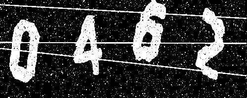
  
  <h1 align="center">Captcha</h1>

#### برسی کد
در پروژه مذکور از سه تابع  که در سه فایل مختلف ایجاد شده به شرح ذیل استفاده شده است  
##### تابع loaddata : 
این تابع کاراکترهای اعداد 0-9 را که هر کدام در فایل جداگانه txt ذخیره شده است را در یک ماتریس ذخیره می‌کند و آن را یه  عنوان خروجی تابع بر می‌گرداند. 
پارامترهای اول ورودی این تابع مسیر پوشه که فایلها در آن قرار دارد و پارامتر دوم متد استفاده شده است که در اینجا یک متد پیاده‌سازی شده و امکان گسترش آن دیده در آتی دیده شده است. 

~~~matlab
function [outmatrix] = loadData(pathDir,method)
%LOADDATA  function creates an matrix of the characters
%   Detailed explanation goes here
if method == 1
    numbers(:,:,1) = dlmread(pathDir+"\1.txt");
    numbers(:,:,2) = dlmread(pathDir+"\2.txt");
    numbers(:,:,3) = dlmread(pathDir+"\3.txt");
    numbers(:,:,4) = dlmread(pathDir+"\4.txt");
    numbers(:,:,5) = dlmread(pathDir+"\5.txt");
    numbers(:,:,6) = dlmread(pathDir+"\6.txt");
    numbers(:,:,7) = dlmread(pathDir+"\7.txt");
    numbers(:,:,8) = dlmread(pathDir+"\8.txt");
    numbers(:,:,9) = dlmread(pathDir+"\9.txt");
    numbers(:,:,10) = dlmread(pathDir+"\0.txt");
    numbers = uint8(numbers);
end
outmatrix = numbers;
end
~~~

  
##### تابع createCaptcha : 
این تابع اصلی برنامه است که وظیفه ایجاد کپجا به وسیله متدهایی، جهت غیر قابل شناسایی کردن حروف برای روباتهای خودکار را بر عهده دارد. 
پارامترهای ورودی تابع به ترتیب شامل : 
ماتریس دیتا که نقش کاراکترها را به تابع ارسال می‌نماید.  
تعداد کاراکترهای درون کپچا که توسط کاربر تعیین شده و تصویر خروجی در نهایت همان تعداد کاراکتر را خواهد داشت . 
شش پارامتر آخر شامل متد های مورد استفاده در ایجاد کپچا جهت ناخوانا شدن تصویر برای رباتها است. نوع  این پارامترهای ورودی بولی بوده  و در صورت true بودن بر کپچا وارد می‌شوند این متدها به ترتیب عبارتند ازانتقال‌عمودی، چرخش حروف، رسم خطوط افقی، نویز ریز و  نویز درشت  
پارامترهای خروجی تابع ، پارامتر اول رشته متن تصادفی ایجاد شده  درون کپچا را برمی گرداند و پارامتر دوم تصویر ایجاد شده کپچا را برمی‌گرداند. 

~~~matlab
function [outText,outImage] = createCaptcha(matrixData,numberChar,move,rotate,destortion,dline,noisesmall,noisebig)
%CREATECAPTCHA function creates an image of the captcha
%   Detailed explanation goes here
%defullt values for parameter is true
if nargin<3
  move = true;
  rotate = true;
  destortion = true;
  dline = true;
  noisesmall = true;
  noisebig = true;
end

numbers_count = numberChar;
numbers =matrixData;
width = 500;
height = 200;

captcha_numbers =  round(rand(1, numbers_count) * 9); % matrix of random 4 number
outText = strjoin(string(captcha_numbers),''); %captcha number
captcha_numbers = uint8(captcha_numbers);
[r,c]=size(numbers(:,:,1));
captcha_image = zeros(r,c*numbers_count,'uint8');
for i = 1 : numbers_count
    if captcha_numbers(1,i) == 0
        captcha_numbers(1,i) = 10;
    end
    
    numbers_f=zeros(r,c,'uint8');
    if move
        B=randi([1,7]); %random move
    else
        B=3;
    end
    numbers_f(1+B:25-7+B,1:25-7)=numbers(4:r-4,4:c-4,captcha_numbers(1,i));
    if destortion
        Q=randi([8,16]); %random destortion D
        P=randi([-1,1]); %random destortion V
        numbers_f(Q:25,2:23)=numbers_f(Q:25,2+P:23+P);
        numbers_f(2:23,Q:25)=numbers_f(2+P:23+P,Q:25);
    end
    if rotate
        A=randi([-20,20]); %random rotate 
        numbers_f= imrotate(numbers_f,A,'bilinear','crop');
    end
    
	captcha_image(1:25,(i*c)-24:c*i) = numbers_f(:,:);
end

if noisebig %big noise
    captcha_image = imresize(captcha_image, [height/2 width/2]);
    captcha_image=imnoise( captcha_image ,'salt & pepper', 0.02 );
end

captcha_image = imresize(captcha_image, [height width]);
if noisesmall %smal noise
    captcha_image=imnoise( captcha_image ,'salt & pepper', 0.05 );
end

if dline % draw line
    for i = 1:randi([2,4])
        captcha_image = rgb2gray(insertShape(captcha_image,'Line',[0 randi([1,height]) width randi([1,height])],'Color', [255,255,255],'Opacity',0.7,'LineWidth',randi([1,3])));
    end
end    

captcha_image = imbinarize(captcha_image, 0.3);
outImage = captcha_image;

end
~~~

 کد زیر پارامترهای تابع را در صورت ارسال نشدن توسط کاربر با مقادیر پیش فرض پر می‌کند . 

  
~~~matlab
if nargin<3
  move = true;
  rotate = true;
  destortion = true;
  dline = true;
  noisesmall = true;
  noisebig = true;
end
~~~

  خطوط زیر جهت دادن مقدارهای اولیه به متغیرهای خصوصی تابع است مخصوصاً طول و عرض تصویر خروجی کپچا که در دو خط آخر مقدار دهی شده است . 

~~~matlab
numbers_count = numberChar;
numbers =matrixData;
width = 500;
height = 200;
~~~

  درخط اول به اندازه تعداد کاراکترهای کپچا عدد تصادفی بینن ۰ تا ۹ تولید می‌شود و در متغیر captcha_numbers قرار می گیرد. 
 درخط دوم کد زیر ماتریس اعداد تصادفی تولید شده به صورت رشته متنی به پارامتر اول خروجی تابع نسبت داده می شود. 
 در خط چهارم اندازه عرض و طول  یک کاراکترماتریس ورودی داده ،در متغیرهای r و c قرار می‌دهد. 
 درخط پنجم یک ماتریس جهت  کار بقیه کد های تابع توسط مقدار دهی اولیه صفر ساخته می شود . 

~~~matlab
captcha_numbers =  round(rand(1, numbers_count) * 9); % matrix of random 4 number
outText = strjoin(string(captcha_numbers),''); %captcha number
captcha_numbers = uint8(captcha_numbers);
[r,c]=size(numbers(:,:,1));
captcha_image = zeros(r,c*numbers_count,'uint8');
~~~

  در کد زیر یک حلقه به تعداد حروف جهت عملیات هایی از جمله متد هایی که برای انجام آنها نیاز به تک تک کاراکترها می باشد ایجاد می کند . 

~~~matlab
for i = 1 : numbers_count
    if captcha_numbers(1,i) == 0
        captcha_numbers(1,i) = 10;
    end
    
    numbers_f=zeros(r,c,'uint8');
~~~

  در کد زیر متد انتقال عمودی هر کاراکتر پیاده‌سازی شده است ابتدا شرط چک می کند که آیا کاربرد تابع پارامتر مربوطه را true کرده است یا نه ، در صورت true بودن آن یک مقدار تصادفی برای جابجایی عمودی بر اساس تعداد پیکسل ها در نظر گرفته می شود، در غیر این صورت کاراکتر جابجا نمی گردد . 

~~~matlab
    if move
        B=randi([1,7]); %random move
    else
        B=3;
    end
    numbers_f(1+B:25-7+B,1:25-7)=numbers(4:r-4,4:c-4,captcha_numbers(1,i));
~~~

  کد زیر متد تغییر فرم کاراکتر ها را در صورت انتخاب توسط کاربر تابع پیاده سازی می کند متد به این شکل است که ابتدا یک مقدار تصادفی از رنج میانه کاراکتر را پیدا کرده و به میزان تصادفی صفر یا یک و یا منفی یک پیکسل در جهت افقی و عمودی ،کاراکتر را شکسته و جابجا می نماید . 

~~~matlab
    if destortion
        Q=randi([8,16]); %random destortion D
        P=randi([-1,1]); %random destortion V
        numbers_f(Q:25,2:23)=numbers_f(Q:25,2+P:23+P);
        numbers_f(2:23,Q:25)=numbers_f(2+P:23+P,Q:25);
    end
~~~

  همانطور که ملاحظه می کنید کد ذیل متد چرخش هر کاراکتر را در صورت انتخاب پیاده سازی می نماید بدین صورت که یک عدد تصادفی بین ۲۰ و منفی ۲۰ درجه انتخاب شده و کاراکتر بر اساس آن می چرخد . 

~~~matlab
    if rotate
        A=randi([-20,20]); %random rotate 
        numbers_f= imrotate(numbers_f,A,'bilinear','crop');
    end
~~~

  آخرین کد درون حلقه‌ی for کاراکترها را که توسط متدهای درون حلقه تغیر کرده‌اند به صورت پشت سرهم درون تصویر کپچا قرار می‌دهد.به زودی به سراغ متدهای خواهیم رفت که در خارج از حلقه باید بر روی کل تصویر پیاده سازی شوند  

~~~matlab
	captcha_image(1:25,(i*c)-24:c*i) = numbers_f(:,:);
end
~~~

 کد ذیل نویز درشت را پیاده سازی می نماید تفاوت ناچیزی بین متد نویز ریز و رشت وجود دارد به این صورت که فقط نویز درشت در تصویر کپچای کوچکتری اعمال می شود تا پس از بزرگ کردن تصویر نویز درشت و محوتری ایجاد شود . 

~~~matlab
if noisebig %big noise
    captcha_image = imresize(captcha_image, [height/2 width/2]);
    captcha_image=imnoise( captcha_image ,'salt & pepper', 0.02 );
end
~~~

  کد زیر نویز فلفل نمکی را در صورت انتخاب توسط پارامترهای ورودی بر روی تصویر اعمال می نماید . 

~~~matlab
captcha_image = imresize(captcha_image, [height width]);
if noisesmall %smal noise
    captcha_image=imnoise( captcha_image ,'salt & pepper', 0.05 );
end
~~~

  آخرین متد پیاده سازی شده در کد زیر به این صورت عمل می نماید که خطوط ای افقی با ضخامتهای مختلف و به صورت تصادفی بر روی تصویر نهایی کپچا، در صورت انتخاب توسط پارامتر ورودی تابع، اعمال می گردد . 

~~~matlab
if dline % draw line
    for i = 1:randi([2,4])
        captcha_image = rgb2gray(insertShape(captcha_image,'Line',[0 randi([1,height]) width randi([1,height])],'Color', [255,255,255],'Opacity',0.7,'LineWidth',randi([1,3])));
    end
end   
~~~

  در نهایت توسط کد ذیل تصویر ایجاد شده در مراحل قبلی به صورت باینری به عنوان پارامتر خروجی تابع تحویل برنامه می گردد . 

~~~matlab
captcha_image = imbinarize(captcha_image, 0.3);
outImage = captcha_image;
~~~

  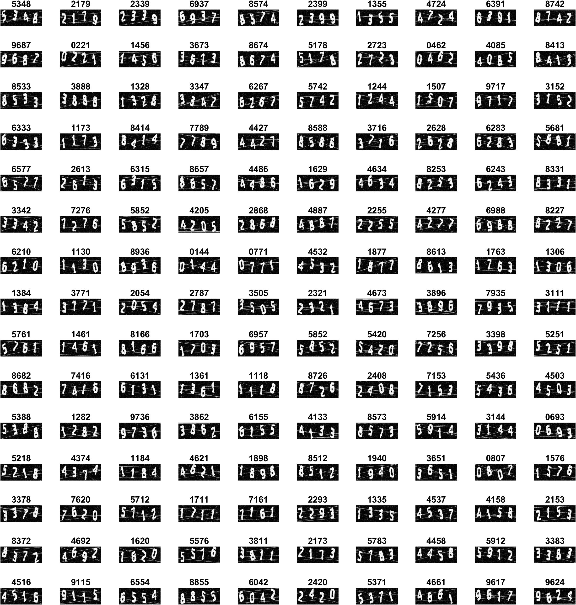
  
  <h3 align="center">تعداد ۱۵۰ تصویر کپجا ایجاد شده توسط این تابع </h3>

  
  ##### تابع ocrdetect : 
این تابع جهت آنالیز تشخیص کپچای تولید شده توسط تابع ocr متلب ایجاد شده است. ورودی تابع رشته متنی که براساس آن کپچا تولید شده و پارامتر ورودی دوم تصویری از کپچا که توسط برنامه تولید شده است را به تابع میفرستد. تابع ocr متلب متن خوانده شده از تصویر را با متن واقعی مقایسه کرده و در صورت درست بودن آن نتیجه  true را برمی‌گرداند پارامترهای خروجی به ترتیب متن خوانده شده، نتیجه مقایسه و در صورتی که مقایسه صحیح باشد تصویر کپچا را به رنگ سبز و در صورت غلط بودن تشخیص تصویر را به رنگ قرمز برمی‌گرداند. 

~~~matlab
function [txtocr,resultOcr,imgRGB] = ocrDetect(txtCaptcha,imgCaptcha)
%OCRDETET  function compare an set image of the captcha with real content
%   input parameters is path of a folder that is contain images of captcha

ocrCaptcha = ocr(imgCaptcha);
imgRGB = zeros(size(imgCaptcha,1),size(imgCaptcha,2),3);
txtocr = strtrim(string(ocrCaptcha.Text));
if string(txtCaptcha) == txtocr
    resultOcr = true;
    blackPixels = imgCaptcha == 0;
    imgRGB(:,:,2) = blackPixels;
else 
    resultOcr = false;
    blackPixels = imgCaptcha == 0;
    imgRGB(:,:,1) = blackPixels;
end

end
~~~

خط اول تصویر ورودی را به عنوان پارامتر به تابع ocr متلب ارسال و خروجی را در متغیر ocrcaptcha ذخیره می نماید. 
 خط دوم یک ماتریس دو بعدی به اندازه تصویر ورودی جهت تغییر رنگ پیش زمینه ایجاد می کند. 
 خط سوم مقدار به دست آمده از تابع ocr را به شکل رشته متنی به خروجی تابع  نسبت می‌دهد . 

~~~matlab
ocrCaptcha = ocr(imgCaptcha);
imgRGB = zeros(size(imgCaptcha,1),size(imgCaptcha,2),3);
txtocr = strtrim(string(ocrCaptcha.Text));
~~~

در صورتی که مقایسه صحیح باشد تصویر کپچا را به رنگ سبز و در صورت غلط بودن تشخیص تصویر را به رنگ قرمز برمی‌گرداند. 

~~~matlab
if string(txtCaptcha) == txtocr
    resultOcr = true;
    blackPixels = imgCaptcha == 0;
    imgRGB(:,:,2) = blackPixels;
else 
    resultOcr = false;
    blackPixels = imgCaptcha == 0;
    imgRGB(:,:,1) = blackPixels;
end
~~~

  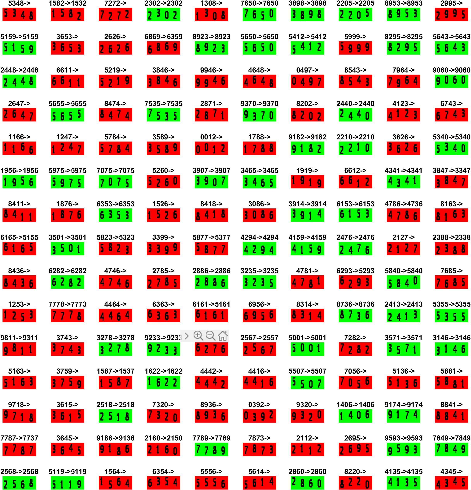
  
  <h3 align="center">خروجی ۱۵۰ تصویر کپجا ایجاد شده توسط این تابع برای متد جابجایی عمودی تصادفی</h3>

	
###	بررسی کد اصلی برنامه 

~~~matlab
clc;close all;clear;

rocr = zeros(1,150,'logical');

%load chacters 0-9
numbers=loadData('data',1);

%create chaptcha
image_path = 'output\';
[~, message, messageid] = rmdir(image_path, 's');
[status, msg, msgID] = mkdir(image_path);
rng(100)
for i = 1:150
    [txtCaptcha,imgCaptcha] = createCaptcha(numbers,4,true,true,true,true,true,true); %create
    
    %detection by ocr
    [textocr,ocrreault,ocrimg] = ocrDetect(txtCaptcha, imgCaptcha);
    rocr(i) = ocrreault;

    imwrite(imgCaptcha, image_path+string(i)+'-('+txtCaptcha+').png'); %save in image folder
    %imwrite(ocrimg, image_path+string(i)+'-('+txtCaptcha+')R.png'); %save in image folder
    
    subplot(15,10,i),imshow(imgCaptcha,'Interpolation','bilinear'),title(txtCaptcha); %show 150 captcha
    %subplot(15,10,i),imshow(ocrimg,'Interpolation','bilinear'),title(txtCaptcha+'->'+textocr); %show 150 captcha
end
set(gcf,'units','pixels','position', [0 0 1000 1000]);
exportgraphics(gcf,"result.jpg",'Resolution',300);

%analysis 
lbl = categorical({'Not detected','detected'});
nft=[sum(rocr == 0) , sum(rocr == 1)];
figure;bar(lbl,nft);title('Bar');ylabel('number');saveas(gcf,"Barchart.png")
~~~

	خط اول کد یک ماتریس جهت ذخیره نتایج با مقدار دهی اولیه صفر ایجاد می نماید. 
 درخط بعدی داده ها مرتبط با نقش کاراکترهای 0 تا 9  توسط فانکشن LoadData خوانده شده و در ماتریس number ذخیره می گردد  

~~~matlab
rocr = zeros(1,150,'logical');

%load chacters 0-9
numbers=loadData('data',1);
~~~

دراین قسمت از کد  درخط اول متغیری قرار دارد که مسیر پوشه خروجی برای فایلهای که چرا در آن مشخص می کنیم. 
 در خط دوم با  دستور redir  در صورت وجود پوشه مشابه آن را پاک می کنیم. 
 در خط سوم با دستور امکا mkdir پوشه مورد نظرمان را در هارد دیسک ایجاد می کنیم. 
 خط چهارم دستور rng ایست که موجب می شود در هر بار اجرای حلقه اعداد تصادفی یکسانی تولید شود.  

~~~matlab
image_path = 'output\';
[~, message, messageid] = rmdir(image_path, 's');
[status, msg, msgID] = mkdir(image_path);
rng(100)
~~~

کد درون حلقه for  بارها  اجرا می شود ابتدا با فانکشن createCaptcha  و ارسال پارامتر های ازجمله ماتریس نقش کاراکتر ها، تعداد کاراکتر ها در کپچا و شش متد قابل استفاده برای ایجاد کپچا استفاده می شود 
 درخط پنج و شش کپچا  تولید شده توسط توسط فانکشن ocrDetect خوانده شده و در صورتی که نتیجه آن با نتیجه عدد واقعی تولید شده برابر باشد مقدار true و در غیر این صورت false در ماتریس نتایج ذخیره می شود. 
 خطوط بعدی کپچا را  در فولدر مورد نظر ما ذخیره می نماید و در نهایت کلیه ۱۵۰ کپچا تولید شده در یک subplot مرتب می گردد . 

~~~matlab
for i = 1:150
    [txtCaptcha,imgCaptcha] = createCaptcha(numbers,4,true,true,true,true,true,true); %create
    
    %detection by ocr
    [textocr,ocrreault,ocrimg] = ocrDetect(txtCaptcha, imgCaptcha);
    rocr(i) = ocrreault;

    imwrite(imgCaptcha, image_path+string(i)+'-('+txtCaptcha+').png'); %save in image folder
    %imwrite(ocrimg, image_path+string(i)+'-('+txtCaptcha+')R.png'); %save in image folder
    
    subplot(15,10,i),imshow(imgCaptcha,'Interpolation','bilinear'),title(txtCaptcha); %show 150 captcha
    %subplot(15,10,i),imshow(ocrimg,'Interpolation','bilinear'),title(txtCaptcha+'->'+textocr); %show 150 captcha
end
set(gcf,'units','pixels','position', [0 0 1000 1000]);
exportgraphics(gcf,"result.jpg",'Resolution',300);
~~~

~~~matlab
lbl = categorical({'Not detected','detected'});
nft=[sum(rocr == 0) , sum(rocr == 1)];
figure;bar(lbl,nft);title('Bar');ylabel('number');saveas(gcf,"Barchart.png")
~~~

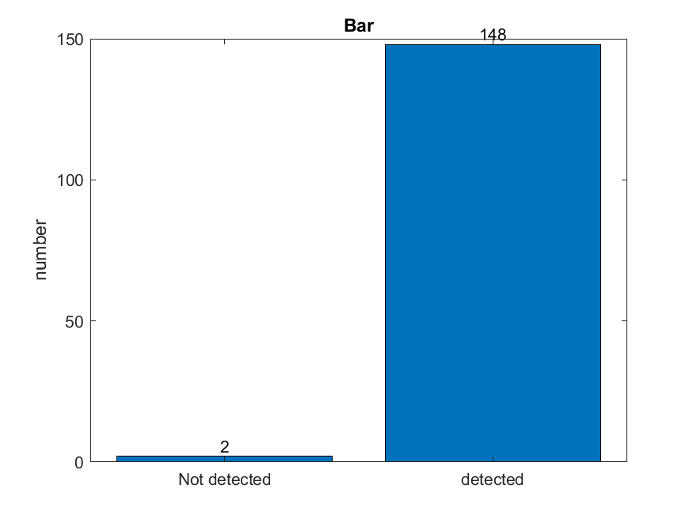
  
  <h3 align="center">خروجی ۱۵۰ تصویر کپجا ایجاد شده توسط این تابع بدون اعمال متدی</h3>

---

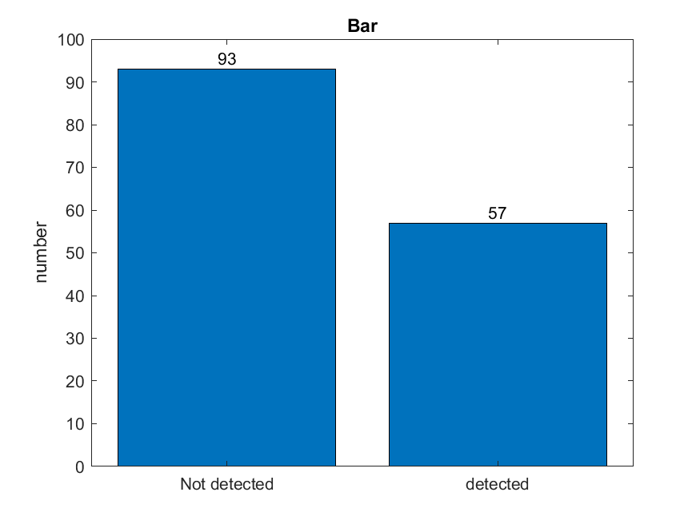
  
  <h3 align="center">خروجی ۱۵۰ تصویر کپجا ایجاد شده توسط این تابع برای متد جابجایی عمودی تصادفی</h3>

---

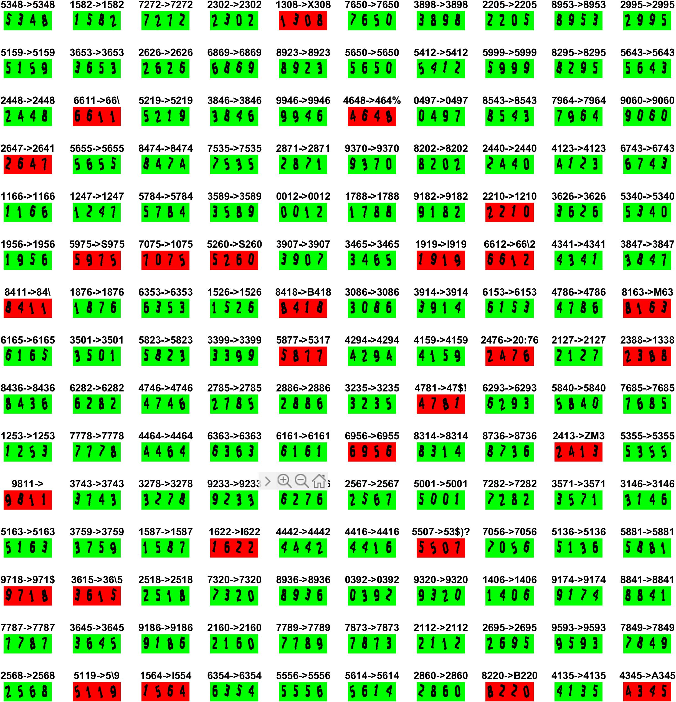
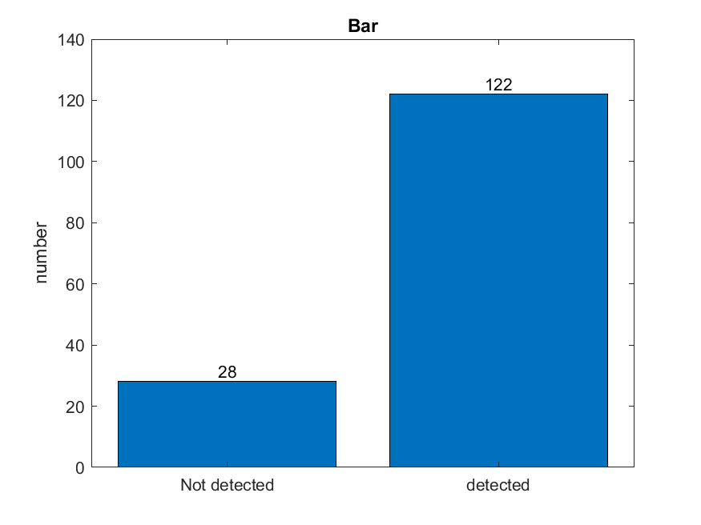
  
  <h3 align="center">خروجی ۱۵۰ تصویر کپجا ایجاد شده توسط این تابع برای متد چرخش</h3>

---

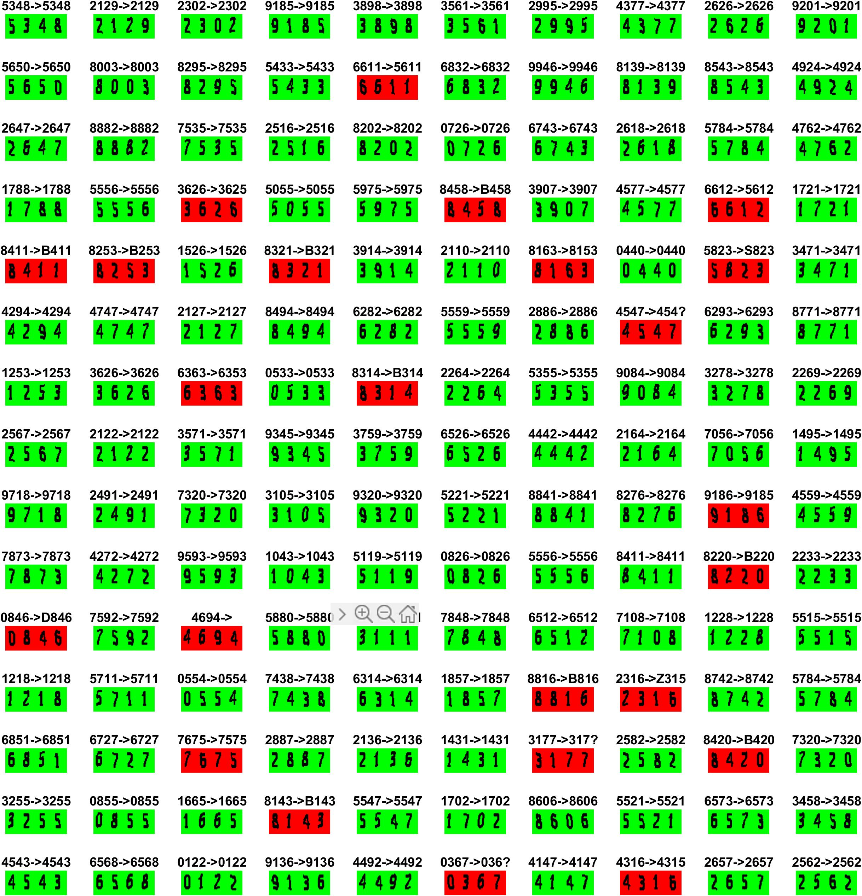
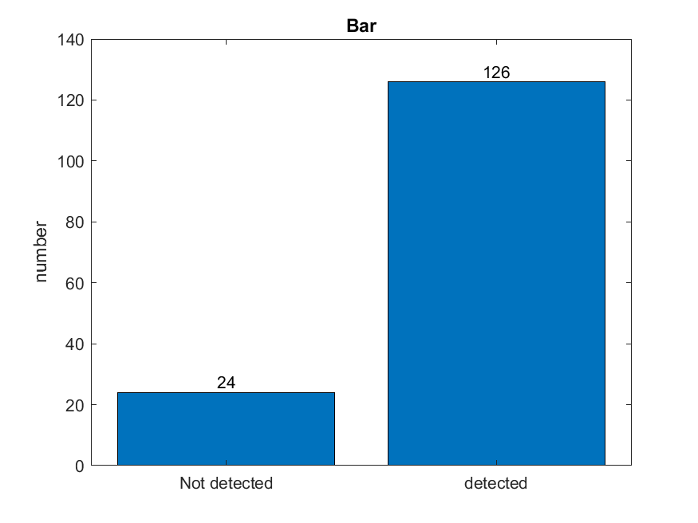
  
  <h3 align="center">خروجی ۱۵۰ تصویر کپجا ایجاد شده توسط این تابع برای متد تغییر شکل</h3>

---

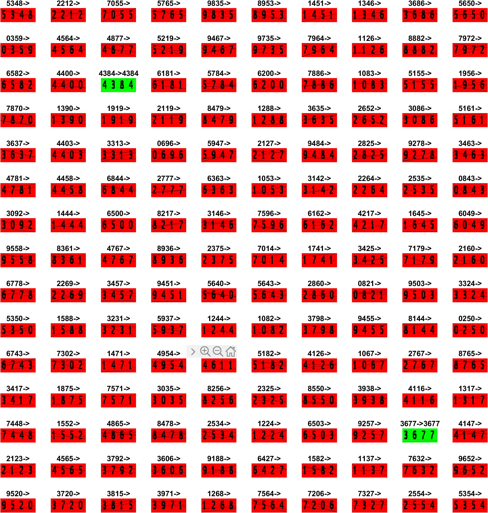
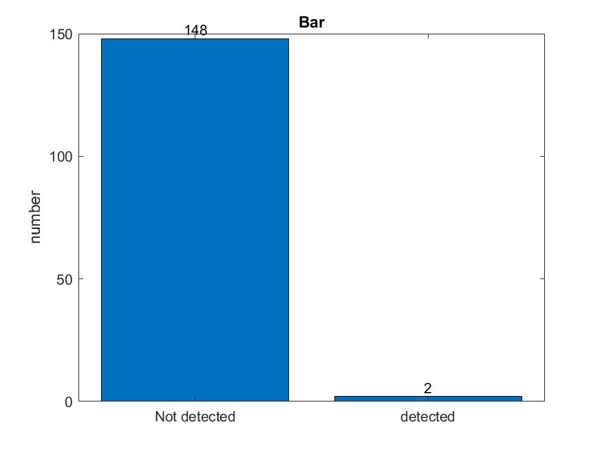
  
  <h3 align="center">خروجی ۱۵۰ تصویر کپجا ایجاد شده توسط این تابع برای متد رسم خطوط  تقریبا افقی</h3>

---

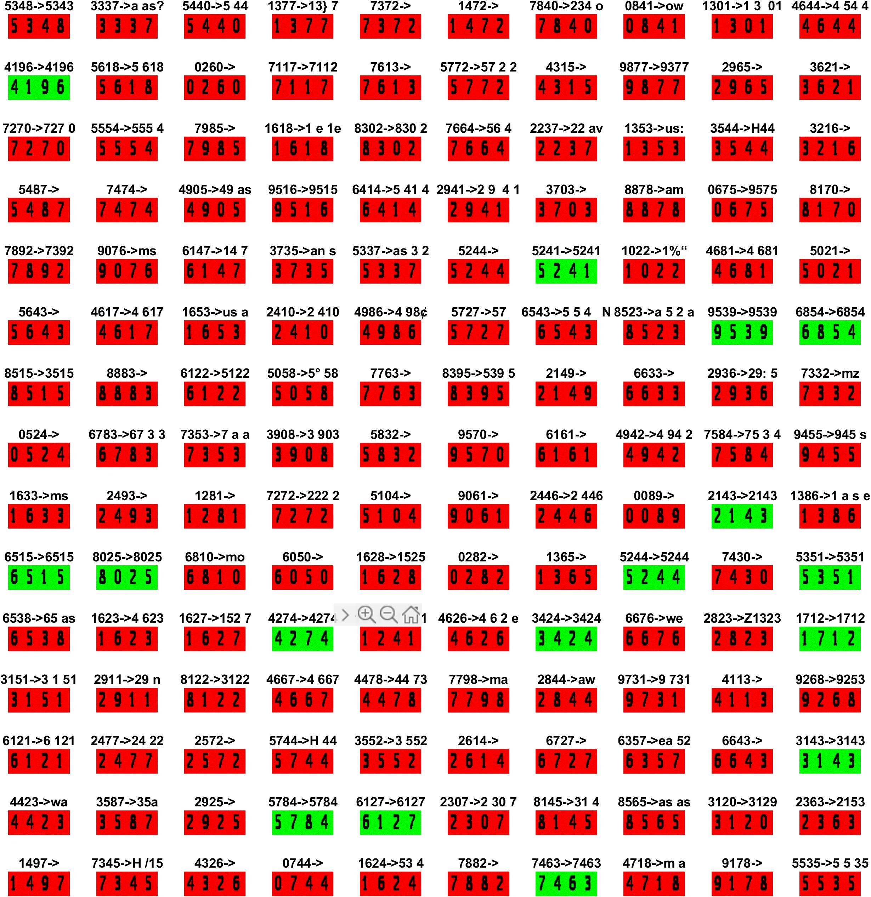
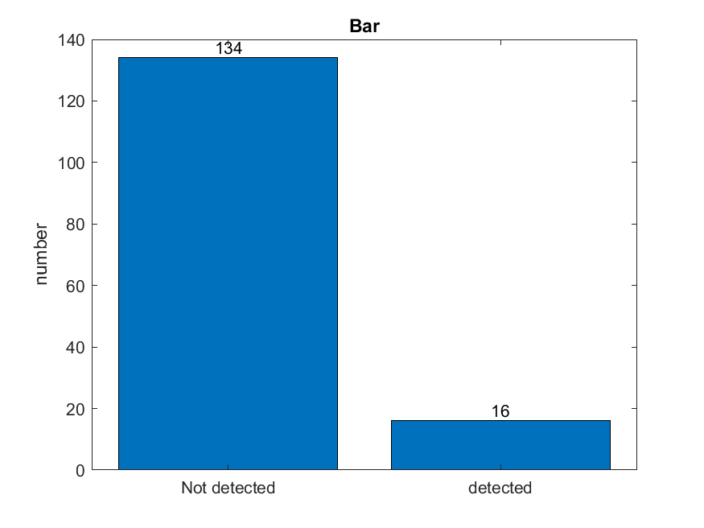
  
  <h3 align="center">خروجی ۱۵۰ تصویر کپجا ایجاد شده توسط این تابع برای متد نویز ریز</h3>

---

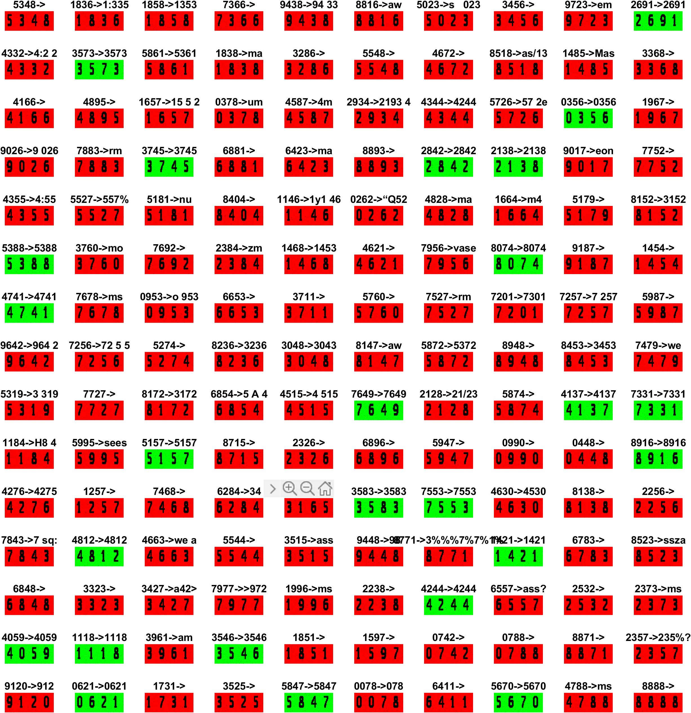
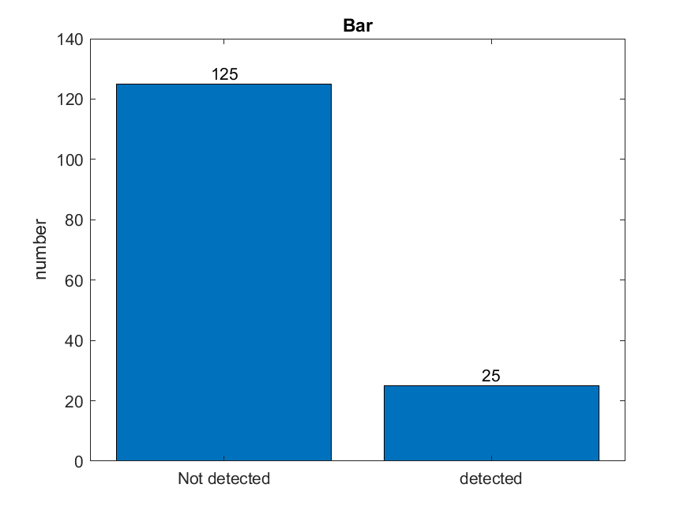
  
  <h3 align="center">خروجی ۱۵۰ تصویر کپجا ایجاد شده توسط این تابع برای متد نویز درشت</h3>

---

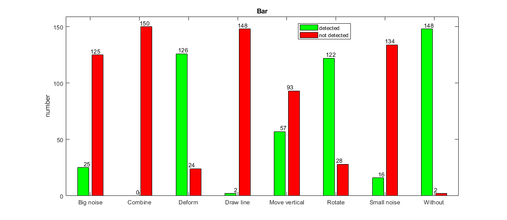
  
  <h3 align="center"> مقایسه متدهای مختلف استفاده شده در ایجاد کپچا</h3>

